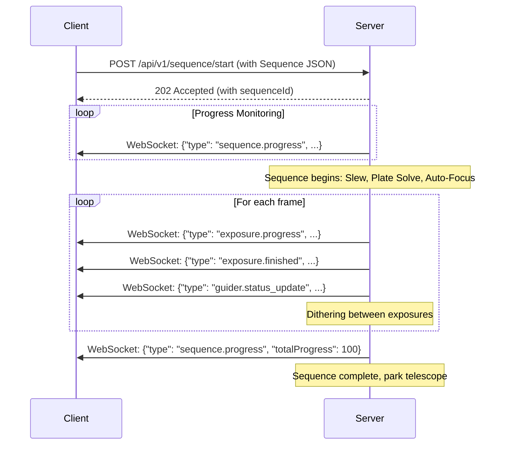

# Astronomical Equipment Control API Specification

This document provides a comprehensive specification for a server backend API designed to control astronomical equipment. The architecture is inspired by modern astrophotography software like NINA, offering both stateless HTTP REST endpoints for simple commands and a stateful WebSocket connection for real-time communication and asynchronous event handling.

---

## 1. API Overview and Architecture

### 1.1. Design Philosophy

The API is designed with the following principles in mind:

- **Modularity:** Devices (Camera, Mount, Focuser, etc.) are treated as independent modules. Each module has its own set of endpoints and WebSocket messages.
- **Real-Time Communication:** For operations requiring continuous feedback (e.g., guiding, focus routines, exposure progress), a WebSocket connection is used to push updates from the server to the client without the overhead of HTTP polling.
- **Stateless Operations:** Standard configuration and control actions that do not require continuous feedback are handled via conventional HTTP REST endpoints.
- **Asynchronous Operations:** Long-running tasks like exposures, sequences, or slewing are initiated via an API call, which returns immediately with a task identifier. Progress is monitored via WebSocket events.

### 1.2. Versioning

The API will be versioned to ensure backward compatibility as new features are added. The version will be included in the URL path for all REST endpoints.

- **Base Path:** `/api/v1`

### 1.3. Communication Protocols

- **HTTP REST:** Used for stateless requests, such as retrieving device properties, setting configurations, or initiating long-running tasks.
- **WebSocket:** Used for real-time, bidirectional communication. This includes:
  - Receiving asynchronous events and notifications (e.g., device status changes, exposure finished).
  - Sending commands that require immediate, low-latency responses.
  - Monitoring the progress of long-running tasks.

## 2. Authentication & Authorization

To ensure secure access, all API requests must be authenticated. The server will use a simple and effective API Key-based authentication scheme.

### 2.1. API Key

- **Mechanism:** Clients must include a unique API key in their requests. This key is pre-generated by the server and assigned to each client application.
- **Transmission:** The API key must be sent in the HTTP headers for REST requests and as part of the initial handshake for WebSocket connections.

#### REST Request Authentication

For REST endpoints, the key should be included in the `X-API-Key` header.

**Example Header:**

```http
X-API-Key: your-super-secret-api-key
```

If the key is missing or invalid, the server will respond with a `401 Unauthorized` status code.

#### WebSocket Connection Authentication

For WebSocket connections, the API key must be sent as a query parameter during the connection handshake.

**Example Connection URL:**

```plaintext
ws://your-server-address/api/v1/ws?apiKey=your-super-secret-api-key
```

The server will validate the key upon connection. If the key is invalid, the server will close the connection immediately with a close code `4001` (Unauthorized).

### 2.2. Authorization

Currently, the model assumes a single-user environment where a valid API key grants full access to all resources. Future extensions could introduce role-based access control (RBAC) with different permission levels (e.g., 'admin', 'operator', 'viewer'), but this is not included in `v1`.

---

## 3. HTTP REST Endpoints

The REST API provides a stateless way to interact with devices, manage settings, and initiate long-running operations. All endpoints are prefixed with `/api/v1`.

### 3.1. Cameras

Provides control over imaging cameras.

#### 3.1.1. List Available Cameras

Retrieves a list of all available cameras.

- **Endpoint:** `GET /api/v1/cameras`
- **Method:** `GET`
- **Authentication:** Required

**Response (Success `200 OK`)**

```json
{
  "status": "success",
  "data": [
    {
      "deviceId": "cam-001",
      "name": "ZWO ASI2600MM Pro",
      "isConnected": true
    },
    {
      "deviceId": "cam-002",
      "name": "QHY268M",
      "isConnected": false
    }
  ]
}
```

#### 3.1.2. Get Camera Status

Retrieves the current status and properties of a specific camera.

- **Endpoint:** `GET /api/v1/cameras/{deviceId}`
- **Method:** `GET`
- **Authentication:** Required

**Response (Success `200 OK`)**

```json
{
  "status": "success",
  "data": {
    "isConnected": true,
    "cameraState": "Idle",
    "coolerOn": true,
    "temperature": -10.5,
    "setpoint": -10.0,
    "coolerPower": 45.5,
    "gain": 100,
    "offset": 50,
    "binning": { "x": 1, "y": 1 },
    "roi": { "x": 0, "y": 0, "width": 6244, "height": 4168 },
    "sensor": {
      "name": "IMX571",
      "resolution": { "width": 6244, "height": 4168 },
      "pixelSize": { "width": 3.76, "height": 3.76 }
    }
  }
}
```

#### 3.1.3. Connect/Disconnect Camera

Manages the connection to a specific camera.

- **Endpoint:** `POST /api/v1/cameras/{deviceId}/connect`
- **Method:** `POST`
- **Authentication:** Required
- **Request Body:**

```json
{
  "connected": true
}
```

**Response (Success `200 OK`)**

```json
{
  "status": "success",
  "message": "Camera connection process initiated."
}
```

#### 3.1.4. Configure Camera Settings

Updates various settings for a specific camera.

- **Endpoint:** `PUT /api/v1/cameras/{deviceId}/settings`
- **Method:** `PUT`
- **Authentication:** Required
- **Request Body:**

```json
{
  "coolerOn": true,
  "setpoint": -15.0,
  "gain": 120,
  "offset": 30,
  "binning": { "x": 2, "y": 2 },
  "roi": { "x": 100, "y": 100, "width": 800, "height": 600 }
}
```

**Response (Success `202 Accepted`)**

```json
{
  "status": "success",
  "message": "Camera settings update initiated."
}
```

#### 3.1.5. Start Exposure

Starts a single exposure on a specific camera.

- **Endpoint:** `POST /api/v1/cameras/{deviceId}/exposure`
- **Method:** `POST`
- **Authentication:** Required
- **Request Body:**

```json
{
  "duration": 300,
  "frameType": "Light",
  "filename": "M31_Light_300s_001.fits"
}
```

**Response (Success `202 Accepted`)**

```json
{
  "status": "success",
  "data": {
    "exposureId": "exp_2a7d3f8e-1b9c-4d3f-8a9a-5f0e1c2b3a4d"
  },
  "message": "Exposure started."
}
```

#### 3.1.6. Abort Exposure

Aborts the currently running exposure on a specific camera.

- **Endpoint:** `POST /api/v1/cameras/{deviceId}/exposure/abort`
- **Method:** `POST`
- **Authentication:** Required

**Response (Success `200 OK`)**

```json
{
  "status": "success",
  "message": "Exposure abort command sent."
}
```

#### 3.1.7. Get Camera Capabilities

Retrieves the capabilities and supported features of a specific camera.

- **Endpoint:** `GET /api/v1/cameras/{deviceId}/capabilities`
- **Method:** `GET`
- **Authentication:** Required

**Response (Success `200 OK`)**

```json
{
  "status": "success",
  "data": {
    "canCool": true,
    "canSetTemperature": true,
    "canAbortExposure": true,
    "canStopExposure": true,
    "canGetCoolerPower": true,
    "hasMechanicalShutter": false,
    "gainRange": {
      "min": 0,
      "max": 600,
      "default": 100
    },
    "offsetRange": {
      "min": 0,
      "max": 100,
      "default": 50
    },
    "temperatureRange": {
      "min": -50.0,
      "max": 50.0
    },
    "binningModes": [
      {"x": 1, "y": 1},
      {"x": 2, "y": 2},
      {"x": 3, "y": 3},
      {"x": 4, "y": 4}
    ],
    "readoutModes": [
      {"name": "High Quality", "id": 0},
      {"name": "Fast", "id": 1}
    ],
    "bayerPattern": "RGGB",
    "pixelSizeX": 3.76,
    "pixelSizeY": 3.76,
    "maxBinX": 4,
    "maxBinY": 4,
    "electronsPerADU": 1.0,
    "fullWellCapacity": 50000,
    "readNoise": 2.3
  }
}
```

**Error Responses:**

- `404 Not Found`: Camera not found (error code: `device_not_found`)
- `503 Service Unavailable`: Camera not connected (error code: `device_not_connected`)

#### 3.1.8. Get Available Gains

Retrieves all available gain values for the camera.

- **Endpoint:** `GET /api/v1/cameras/{deviceId}/gains`
- **Method:** `GET`
- **Authentication:** Required

**Response (Success `200 OK`)**

```json
{
  "status": "success",
  "data": {
    "gains": [0, 50, 100, 150, 200, 250, 300, 350, 400, 450, 500, 550, 600],
    "currentGain": 100,
    "defaultGain": 100,
    "unityGain": 139
  }
}
```

#### 3.1.9. Get Available Offsets

Retrieves all available offset values for the camera.

- **Endpoint:** `GET /api/v1/cameras/{deviceId}/offsets`
- **Method:** `GET`
- **Authentication:** Required

**Response (Success `200 OK`)**

```json
{
  "status": "success",
  "data": {
    "offsets": [0, 10, 20, 30, 40, 50, 60, 70, 80, 90, 100],
    "currentOffset": 50,
    "defaultOffset": 50
  }
}
```

#### 3.1.10. Set Cooler Power

Manually controls the cooler power (advanced users only).

- **Endpoint:** `PUT /api/v1/cameras/{deviceId}/cooler-power`
- **Method:** `PUT`
- **Authentication:** Required
- **Request Body:**

```json
{
  "power": 75.0,
  "mode": "manual"
}
```

**Response (Success `200 OK`)**

```json
{
  "status": "success",
  "message": "Cooler power set to manual mode."
}
```

**Error Responses:**

- `400 Bad Request`: Invalid power value (error code: `invalid_field_value`)
- `409 Conflict`: Camera does not support manual cooler control

#### 3.1.11. Warm Up Camera

Initiates a controlled camera warm-up sequence.

- **Endpoint:** `POST /api/v1/cameras/{deviceId}/warmup`
- **Method:** `POST`
- **Authentication:** Required

**Response (Success `202 Accepted`)**

```json
{
  "status": "success",
  "message": "Camera warm-up sequence initiated.",
  "data": {
    "targetTemperature": 20.0,
    "estimatedTime": 600
  }
}
```

### 3.2. Mounts/Telescopes

Provides control over telescope mounts.

#### 3.2.1. List Available Mounts

- **Endpoint:** `GET /api/v1/mounts`
- **Method:** `GET`
- **Authentication:** Required

**Response (Success `200 OK`)**

```json
{
  "status": "success",
  "data": [
    {
      "deviceId": "mnt-001",
      "name": "Sky-Watcher EQ6-R Pro",
      "isConnected": true
    }
  ]
}
```

#### 3.2.2. Get Mount Status

- **Endpoint:** `GET /api/v1/mounts/{deviceId}`
- **Method:** `GET`
- **Authentication:** Required

**Response (Success `200 OK`)**

```json
{
  "status": "success",
  "data": {
    "isConnected": true,
    "isSlewing": false,
    "isTracking": true,
    "isParked": false,
    "coordinates": {
      "ra": "22:34:15.05",
      "dec": "+45:12:03.3"
    },
    "altitude": 45.2,
    "azimuth": 180.5,
    "pierSide": "East"
  }
}
```

#### 3.2.3. Connect/Disconnect Mount

- **Endpoint:** `POST /api/v1/mounts/{deviceId}/connect`
- **Method:** `POST`
- **Authentication:** Required
- **Request Body:**

```json
{
  "connected": true
}
```

**Response (Success `200 OK`)**

```json
{
  "status": "success",
  "message": "Mount connection process initiated."
}
```

#### 3.2.4. Slew to Coordinates

- **Endpoint:** `POST /api/v1/mounts/{deviceId}/slew`
- **Method:** `POST`
- **Authentication:** Required
- **Request Body:**

```json
{
  "ra": "05:34:31.97",
  "dec": "-05:23:22.8"
}
```

**Response (Success `202 Accepted`)**

```json
{
  "status": "success",
  "message": "Slew command accepted."
}
```

#### 3.2.5. Set Tracking

- **Endpoint:** `PUT /api/v1/mounts/{deviceId}/tracking`
- **Method:** `PUT`
- **Authentication:** Required
- **Request Body:**

```json
{
  "tracking": true
}
```

**Response (Success `200 OK`)**

```json
{
  "status": "success",
  "message": "Tracking state updated."
}
```

#### 3.2.6. Park or Home Mount

- **Endpoint:** `POST /api/v1/mounts/{deviceId}/position`
- **Method:** `POST`
- **Authentication:** Required
- **Request Body:**

```json
{
  "command": "park"
}
```

**Response (Success `202 Accepted`)**

```json
{
  "status": "success",
  "message": "Mount command accepted."
}
```

#### 3.2.7. Pulse Guide

Sends a manual guiding pulse to the mount.

- **Endpoint:** `POST /api/v1/mounts/{deviceId}/pulse-guide`
- **Method:** `POST`
- **Authentication:** Required
- **Request Body:**

```json
{
  "direction": "North",
  "duration": 500
}
```

**Response (Success `202 Accepted`)**

```json
{
  "status": "success",
  "message": "Pulse guide command sent."
}
```

#### 3.2.8. Sync Mount Position

Synchronizes the mount's coordinate system with actual coordinates.

- **Endpoint:** `POST /api/v1/mounts/{deviceId}/sync`
- **Method:** `POST`
- **Authentication:** Required
- **Request Body:**

```json
{
  "ra": "05:34:31.97",
  "dec": "-05:23:22.8"
}
```

**Response (Success `200 OK`)**

```json
{
  "status": "success",
  "message": "Mount position synchronized.",
  "data": {
    "syncError": {
      "raError": 0.002,
      "decError": 0.003
    }
  }
}
```

**Error Responses:**

- `400 Bad Request`: Invalid coordinates (error code: `invalid_coordinates`)
- `503 Service Unavailable`: Mount not connected (error code: `device_not_connected`)

#### 3.2.9. Get Mount Capabilities

Retrieves the capabilities and limits of the mount.

- **Endpoint:** `GET /api/v1/mounts/{deviceId}/capabilities`
- **Method:** `GET`
- **Authentication:** Required

**Response (Success `200 OK`)**

```json
{
  "status": "success",
  "data": {
    "canPark": true,
    "canUnpark": true,
    "canFindHome": true,
    "canSetTracking": true,
    "canSetGuideRates": true,
    "canPulseGuide": true,
    "canSync": true,
    "canSlewAsync": true,
    "canSlewAltAz": false,
    "hasEquatorialSystem": true,
    "alignmentMode": "German Equatorial",
    "trackingRates": ["Sidereal", "Lunar", "Solar", "King"],
    "axisRates": {
      "ra": {
        "min": 0.0,
        "max": 4.0
      },
      "dec": {
        "min": 0.0,
        "max": 4.0
      }
    },
    "guideRates": {
      "ra": 0.5,
      "dec": 0.5
    },
    "slewSettleTime": 3
  }
}
```

#### 3.2.10. Set Guide Rates

Configures the guide rates for pulse guiding.

- **Endpoint:** `PUT /api/v1/mounts/{deviceId}/guide-rates`
- **Method:** `PUT`
- **Authentication:** Required
- **Request Body:**

```json
{
  "raRate": 0.5,
  "decRate": 0.5
}
```

**Response (Success `200 OK`)**

```json
{
  "status": "success",
  "message": "Guide rates updated successfully."
}
```

**Fields:**

- **`raRate`** (number): RA guide rate multiplier (typical range: 0.1-1.0)
- **`decRate`** (number): Dec guide rate multiplier (typical range: 0.1-1.0)

#### 3.2.11. Set Tracking Rate

Sets the mount's tracking rate mode.

- **Endpoint:** `PUT /api/v1/mounts/{deviceId}/tracking-rate`
- **Method:** `PUT`
- **Authentication:** Required
- **Request Body:**

```json
{
  "rate": "Sidereal"
}
```

**Response (Success `200 OK`)**

```json
{
  "status": "success",
  "message": "Tracking rate set to Sidereal."
}
```

**Valid rates:** `"Sidereal"`, `"Lunar"`, `"Solar"`, `"King"`

#### 3.2.12. Stop Mount Movement

Immediately stops all mount motion (emergency stop).

- **Endpoint:** `POST /api/v1/mounts/{deviceId}/stop`
- **Method:** `POST`
- **Authentication:** Required

**Response (Success `200 OK`)**

```json
{
  "status": "success",
  "message": "Mount motion stopped."
}
```

#### 3.2.13. Get Side of Pier

Returns which side of the pier the mount is currently on.

- **Endpoint:** `GET /api/v1/mounts/{deviceId}/pier-side`
- **Method:** `GET`
- **Authentication:** Required

**Response (Success `200 OK`)**

```json
{
  "status": "success",
  "data": {
    "pierSide": "East",
    "timeToFlip": 3600,
    "destinationAfterFlip": "West"
  }
}
```

**Pier Side Values:** `"East"`, `"West"`, `"Unknown"`

#### 3.2.14. Perform Meridian Flip

Manually initiates a meridian flip operation.

- **Endpoint:** `POST /api/v1/mounts/{deviceId}/meridian-flip`
- **Method:** `POST`
- **Authentication:** Required

**Response (Success `202 Accepted`)**

```json
{
  "status": "success",
  "message": "Meridian flip initiated.",
  "data": {
    "estimatedTime": 60
  }
}
```

### 3.3. Focusers

Provides control over electronic focusers.

#### 3.3.1. List Available Focusers

- **Endpoint:** `GET /api/v1/focusers`
- **Method:** `GET`
- **Authentication:** Required

**Response (Success `200 OK`)**

```json
{
  "status": "success",
  "data": [
    {
      "deviceId": "foc-001",
      "name": "ZWO EAF",
      "isConnected": true
    }
  ]
}
```

#### 3.3.2. Get Focuser Status

- **Endpoint:** `GET /api/v1/focusers/{deviceId}`
- **Method:** `GET`
- **Authentication:** Required

**Response (Success `200 OK`)**

```json
{
  "status": "success",
  "data": {
    "isConnected": true,
    "isMoving": false,
    "position": 3452,
    "temperature": 12.7,
    "tempComp": {
      "enabled": true,
      "coefficient": -5.5
    }
  }
}
```

#### 3.3.3. Connect/Disconnect Focuser

- **Endpoint:** `POST /api/v1/focusers/{deviceId}/connect`
- **Method:** `POST`
- **Authentication:** Required
- **Request Body:**

```json
{
  "connected": true
}
```

**Response (Success `200 OK`)**

```json
{
  "status": "success",
  "message": "Focuser connection process initiated."
}
```

#### 3.3.4. Move Focuser

- **Endpoint:** `POST /api/v1/focusers/{deviceId}/move`
- **Method:** `POST`
- **Authentication:** Required
- **Request Body:**

```json
{
  "position": 3500,
  "offset": -50,
  "isRelative": false
}
```

#### 3.3.5. Configure Focuser Settings

Updates settings for a specific focuser, such as temperature compensation.

- **Endpoint:** `PUT /api/v1/focusers/{deviceId}/settings`
- **Method:** `PUT`
- **Authentication:** Required
- **Request Body:**

```json
{
  "tempComp": {
    "enabled": true,
    "coefficient": -6.2
  }
}
```

**Response (Success `202 Accepted`)**

```json
{
  "status": "success",
  "message": "Focuser settings update initiated."
}
```

#### 3.3.6. Halt Focuser Movement

Immediately stops focuser movement.

- **Endpoint:** `POST /api/v1/focusers/{deviceId}/halt`
- **Method:** `POST`
- **Authentication:** Required

**Response (Success `200 OK`)**

```json
{
  "status": "success",
  "message": "Focuser movement halted."
}
```

#### 3.3.7. Get Focuser Capabilities

Retrieves the capabilities and limits of the focuser.

- **Endpoint:** `GET /api/v1/focusers/{deviceId}/capabilities`
- **Method:** `GET`
- **Authentication:** Required

**Response (Success `200 OK`)**

```json
{
  "status": "success",
  "data": {
    "canHalt": true,
    "canReverse": false,
    "canAbsoluteMove": true,
    "canRelativeMove": true,
    "canTempComp": true,
    "maxPosition": 50000,
    "maxIncrement": 5000,
    "stepSize": 1.0,
    "tempCompAvailable": true,
    "hasTemperatureSensor": true
  }
}
```

#### 3.3.8. Start Autofocus

Initiates an autofocus routine using the Half-Flux Radius (HFR) method.

- **Endpoint:** `POST /api/v1/focusers/{deviceId}/autofocus`
- **Method:** `POST`
- **Authentication:** Required
- **Request Body:**

```json
{
  "method": "HFR",
  "initialStep": 200,
  "numberOfSteps": 9,
  "exposure": 3.0,
  "binning": {"x": 2, "y": 2},
  "useSubframe": true,
  "filterPosition": 1
}
```

**Response (Success `202 Accepted`)**

```json
{
  "status": "success",
  "message": "Autofocus routine initiated.",
  "data": {
    "autofocusId": "af_abc123def",
    "estimatedTime": 180
  }
}
```

**Fields:**

- **`method`** (string): Autofocus method (`"HFR"`, `"FWHM"`, `"contrast"`)
- **`initialStep`** (number): Initial step size for coarse focus
- **`numberOfSteps`** (number): Number of focus positions to sample (odd number recommended)
- **`exposure`** (number): Exposure duration for each focus sample
- **`binning`** (object, optional): Binning to use during autofocus
- **`useSubframe`** (boolean, optional): Use subframe to speed up autofocus
- **`filterPosition`** (number, optional): Filter position to use during autofocus

#### 3.3.9. Get Autofocus Status

Retrieves the status of an ongoing autofocus routine.

- **Endpoint:** `GET /api/v1/focusers/{deviceId}/autofocus/{autofocusId}`
- **Method:** `GET`
- **Authentication:** Required

**Response (Success `200 OK`)**

```json
{
  "status": "success",
  "data": {
    "autofocusId": "af_abc123def",
    "status": "running",
    "progress": 45.0,
    "currentPosition": 3250,
    "currentHFR": 2.1,
    "bestPosition": 3200,
    "bestHFR": 1.85,
    "measurements": [
      {"position": 3000, "hfr": 2.5, "starCount": 45},
      {"position": 3100, "hfr": 2.2, "starCount": 47},
      {"position": 3200, "hfr": 1.85, "starCount": 48}
    ]
  }
}
```

**Status Values:** `"running"`, `"completed"`, `"failed"`, `"aborted"`

### 3.4. Filter Wheels

Provides control over filter wheels.

#### 3.4.1. List Available Filter Wheels

- **Endpoint:** `GET /api/v1/filterwheels`
- **Method:** `GET`
- **Authentication:** Required

**Response (Success `200 OK`)**

```json
{
  "status": "success",
  "data": [
    {
      "deviceId": "fw-001",
      "name": "ZWO 8-position EFW",
      "isConnected": true
    }
  ]
}
```

#### 3.4.2. Get Filter Wheel Status

- **Endpoint:** `GET /api/v1/filterwheels/{deviceId}`
- **Method:** `GET`
- **Authentication:** Required

**Response (Success `200 OK`)**

```json
{
  "status": "success",
  "data": {
    "isConnected": true,
    "isMoving": false,
    "position": 3,
    "filters": [
      { "slot": 1, "name": "Luminance" },
      { "slot": 2, "name": "Red" }
    ]
  }
}
```

#### 3.4.3. Connect/Disconnect Filter Wheel

Manages the connection to a specific filter wheel.

- **Endpoint:** `POST /api/v1/filterwheels/{deviceId}/connect`
- **Method:** `POST`
- **Authentication:** Required
- **Request Body:**

```json
{
  "connected": true
}
```

**Response (Success `200 OK`)**

```json
{
  "status": "success",
  "message": "Filter wheel connection process initiated."
}
```

**Error Responses:**

- `404 Not Found`: Filter wheel not found (error code: `device_not_found`)
- `503 Service Unavailable`: Connection failed (error code: `connection_failed`)

#### 3.4.4. Set Filter Position

Moves the filter wheel to a specific filter position.

- **Endpoint:** `POST /api/v1/filterwheels/{deviceId}/position`
- **Method:** `POST`
- **Authentication:** Required
- **Request Body:**

```json
{
  "position": 2
}
```

**Response (Success `202 Accepted`)**

```json
{
  "status": "success",
  "message": "Filter wheel move initiated.",
  "data": {
    "targetPosition": 2,
    "targetFilterName": "Red",
    "estimatedTime": 3
  }
}
```

**Error Responses:**

- `400 Bad Request`: Invalid filter position (error code: `invalid_filter_position`)
- `409 Conflict`: Filter wheel is already moving (error code: `device_busy`)

#### 3.4.5. Set Filter by Name

Moves the filter wheel to a filter by its name.

- **Endpoint:** `POST /api/v1/filterwheels/{deviceId}/filter`
- **Method:** `POST`
- **Authentication:** Required
- **Request Body:**

```json
{
  "filterName": "Luminance"
}
```

**Response (Success `202 Accepted`)**

```json
{
  "status": "success",
  "message": "Filter wheel move initiated.",
  "data": {
    "targetPosition": 1,
    "targetFilterName": "Luminance",
    "estimatedTime": 3
  }
}
```

**Error Responses:**

- `404 Not Found`: Filter name not found (error code: `filter_not_found`)

#### 3.4.6. Get Filter Wheel Capabilities

Retrieves the capabilities and configuration of the filter wheel.

- **Endpoint:** `GET /api/v1/filterwheels/{deviceId}/capabilities`
- **Method:** `GET`
- **Authentication:** Required

**Response (Success `200 OK`)**

```json
{
  "status": "success",
  "data": {
    "numPositions": 8,
    "canSetNames": true,
    "canSetOffsets": true,
    "supportsHalting": true,
    "moveTime": 3.0,
    "positionNames": [
      "Luminance",
      "Red",
      "Green",
      "Blue",
      "Ha",
      "OIII",
      "SII",
      "Empty"
    ]
  }
}
```

#### 3.4.7. Configure Filter Names

Updates the names of filters in each position.

- **Endpoint:** `PUT /api/v1/filterwheels/{deviceId}/filters`
- **Method:** `PUT`
- **Authentication:** Required
- **Request Body:**

```json
{
  "filters": [
    {"slot": 1, "name": "Luminance"},
    {"slot": 2, "name": "Red"},
    {"slot": 3, "name": "Green"},
    {"slot": 4, "name": "Blue"},
    {"slot": 5, "name": "Ha"},
    {"slot": 6, "name": "OIII"},
    {"slot": 7, "name": "SII"},
    {"slot": 8, "name": "Empty"}
  ]
}
```

**Response (Success `200 OK`)**

```json
{
  "status": "success",
  "message": "Filter names updated successfully."
}
```

**Error Responses:**

- `400 Bad Request`: Invalid slot number (error code: `invalid_field_value`)

#### 3.4.8. Get Filter Focus Offsets

Retrieves the focus offsets for each filter position.

- **Endpoint:** `GET /api/v1/filterwheels/{deviceId}/offsets`
- **Method:** `GET`
- **Authentication:** Required

**Response (Success `200 OK`)**

```json
{
  "status": "success",
  "data": {
    "offsets": [
      {"slot": 1, "name": "Luminance", "offset": 0},
      {"slot": 2, "name": "Red", "offset": -25},
      {"slot": 3, "name": "Green", "offset": -15},
      {"slot": 4, "name": "Blue", "offset": 35},
      {"slot": 5, "name": "Ha", "offset": -45},
      {"slot": 6, "name": "OIII", "offset": -30},
      {"slot": 7, "name": "SII", "offset": -40},
      {"slot": 8, "name": "Empty", "offset": 0}
    ]
  }
}
```

**Note:** Offsets are in focuser steps relative to the reference filter (typically Luminance).

#### 3.4.9. Set Filter Focus Offsets

Updates the focus offsets for each filter position.

- **Endpoint:** `PUT /api/v1/filterwheels/{deviceId}/offsets`
- **Method:** `PUT`
- **Authentication:** Required
- **Request Body:**

```json
{
  "offsets": [
    {"slot": 1, "offset": 0},
    {"slot": 2, "offset": -25},
    {"slot": 3, "offset": -15},
    {"slot": 4, "offset": 35},
    {"slot": 5, "offset": -45},
    {"slot": 6, "offset": -30},
    {"slot": 7, "offset": -40},
    {"slot": 8, "offset": 0}
  ]
}
```

**Response (Success `200 OK`)**

```json
{
  "status": "success",
  "message": "Filter offsets updated successfully."
}
```

**Error Responses:**

- `400 Bad Request`: Invalid offset value (error code: `invalid_field_value`)

#### 3.4.10. Halt Filter Wheel Movement

Immediately stops filter wheel movement.

- **Endpoint:** `POST /api/v1/filterwheels/{deviceId}/halt`
- **Method:** `POST`
- **Authentication:** Required

**Response (Success `200 OK`)**

```json
{
  "status": "success",
  "message": "Filter wheel movement halted."
}
```

**Error Responses:**

- `409 Conflict`: Filter wheel is not moving (error code: `device_not_moving`)

#### 3.4.11. Calibrate Filter Wheel

Initiates a calibration sequence to determine filter positions.

- **Endpoint:** `POST /api/v1/filterwheels/{deviceId}/calibrate`
- **Method:** `POST`
- **Authentication:** Required

**Response (Success `202 Accepted`)**

```json
{
  "status": "success",
  "message": "Filter wheel calibration initiated.",
  "data": {
    "estimatedTime": 30
  }
}
```

**Note:** Calibration moves the filter wheel through all positions to establish accurate positioning.

### 3.5. Domes / Observatories

Provides control over dome or observatory structures.

#### 3.5.1. List Available Domes

- **Endpoint:** `GET /api/v1/domes`
- **Method:** `GET`
- **Authentication:** Required

**Response (Success `200 OK`)**

```json
{
  "status": "success",
  "data": [
    {
      "deviceId": "dome-001",
      "name": "Pulsar 2.2M Dome",
      "isConnected": true
    }
  ]
}
```

#### 3.5.2. Get Dome Status

- **Endpoint:** `GET /api/v1/domes/{deviceId}`
- **Method:** `GET`
- **Authentication:** Required

**Response (Success `200 OK`)**

```json
{
  "status": "success",
  "data": {
    "isConnected": true,
    "shutterStatus": "Open",
    "isSlaved": true,
    "azimuth": 181.0
  }
}
```

#### 3.5.3. Control Shutter

- **Endpoint:** `POST /api/v1/domes/{deviceId}/shutter`
- **Method:** `POST`
- **Authentication:** Required
- **Request Body:**

```json
{
  "command": "open"
}
```

**Response (Success `202 Accepted`)**

```json
{
  "status": "success",
  "message": "Dome shutter command accepted."
}
```

#### 3.5.4. Slave to Telescope

- **Endpoint:** `PUT /api/v1/domes/{deviceId}/slave`
- **Method:** `PUT`
- **Authentication:** Required
- **Request Body:**

```json
{
  "slaved": true
}
```

**Response (Success `200 OK`)**

```json
{
  "status": "success",
  "message": "Dome slaving status updated."
}
```

### 3.6. Weather Stations

Provides access to environmental data.

#### 3.6.1. List Available Weather Stations

- **Endpoint:** `GET /api/v1/weatherstations`
- **Method:** `GET`
- **Authentication:** Required

**Response (Success `200 OK`)**

```json
{
  "status": "success",
  "data": [
    {
      "deviceId": "wxt-001",
      "name": "AAG Cloud Watcher",
      "isConnected": true
    }
  ]
}
```

#### 3.6.2. Get Weather Data

- **Endpoint:** `GET /api/v1/weatherstations/{deviceId}`
- **Method:** `GET`
- **Authentication:** Required

**Response (Success `200 OK`)**

```json
{
  "status": "success",
  "data": {
    "isConnected": true,
    "temperature": 10.2,
    "humidity": 88.0,
    "dewPoint": 8.3,
    "windSpeed": 15.0,
    "cloudCover": 10.0,
    "skyBrightness": 18.5
  }
}
```

### 3.7. Flat Panels / Light Boxes

Provides control over calibration flat panels.

#### 3.7.1. List Available Flat Panels

- **Endpoint:** `GET /api/v1/flatpanels`
- **Method:** `GET`
- **Authentication:** Required

**Response (Success `200 OK`)**

```json
{
  "status": "success",
  "data": [
    {
      "deviceId": "flat-001",
      "name": "Flip-Flat",
      "isConnected": true
    }
  ]
}
```

#### 3.7.2. Get Flat Panel Status

- **Endpoint:** `GET /api/v1/flatpanels/{deviceId}`
- **Method:** `GET`
- **Authentication:** Required

**Response (Success `200 OK`)**

```json
{
  "status": "success",
  "data": {
    "isConnected": true,
    "isOn": true,
    "brightness": 150
  }
}
```

#### 3.7.3. Control Flat Panel

- **Endpoint:** `POST /api/v1/flatpanels/{deviceId}/state`
- **Method:** `POST`
- **Authentication:** Required
- **Request Body:**

```json
{
  "on": true,
  "brightness": 200
}
```

**Response (Success `200 OK`)**

```json
{
  "status": "success",
  "message": "Flat panel state updated."
}
```

### 3.8. Guiders

Provides control over autoguiding systems.

#### 3.8.1. List Available Guiders

- **Endpoint:** `GET /api/v1/guiders`
- **Method:** `GET`
- **Authentication:** Required

**Response (Success `200 OK`)**

```json
{
  "status": "success",
  "data": [
    {
      "deviceId": "gdr-001",
      "name": "ZWO ASI120MM Mini",
      "isConnected": true
    }
  ]
}
```

#### 3.8.2. Get Guider Status

- **Endpoint:** `GET /api/v1/guiders/{deviceId}`
- **Method:** `GET`
- **Authentication:** Required

**Response (Success `200 OK`)**

```json
{
  "status": "success",
  "data": {
    "isGuiding": true,
    "rmsError": {
      "ra": 0.45,
      "dec": 0.38,
      "total": 0.59
    },
    "starMass": 2500,
    "snr": 25.6
  }
}
```

#### 3.8.3. Start/Stop Guiding

- **Endpoint:** `POST /api/v1/guiders/{deviceId}/state`
- **Method:** `POST`
- **Authentication:** Required
- **Request Body:**

```json
{
  "guiding": true
}
```

**Response (Success `202 Accepted`)**

```json
{
  "status": "success",
  "message": "Guiding command accepted."
}
```

#### 3.8.4. Trigger Dithering

- **Endpoint:** `POST /api/v1/guiders/{deviceId}/dither`
- **Method:** `POST`
- **Authentication:** Required
- **Request Body:**

```json
{
  "amount": 2.5,
  "settleTime": 15
}
```

**Response (Success `202 Accepted`)**

```json
{
  "status": "success",
  "message": "Dithering initiated."
}
```

### 3.9. Rotators

Provides control over field rotators.

#### 3.9.1. List Available Rotators

- **Endpoint:** `GET /api/v1/rotators`
- **Method:** `GET`
- **Authentication:** Required

**Response (Success `200 OK`)**

```json
{
  "status": "success",
  "data": [
    {
      "deviceId": "rot-001",
      "name": "Optec Pyxis",
      "isConnected": true
    }
  ]
}
```

#### 3.9.2. Get Rotator Status

- **Endpoint:** `GET /api/v1/rotators/{deviceId}`
- **Method:** `GET`
- **Authentication:** Required

**Response (Success `200 OK`)**

```json
{
  "status": "success",
  "data": {
    "isConnected": true,
    "isMoving": false,
    "angle": 178.5
  }
}
```

#### 3.9.3. Move Rotator

- **Endpoint:** `POST /api/v1/rotators/{deviceId}/move`
- **Method:** `POST`
- **Authentication:** Required
- **Request Body:**

```json
{
  "angle": 270.0
}
```

**Response (Success `202 Accepted`)**

```json
{
  "status": "success",
  "message": "Rotator move initiated."
}
```

### 3.10. Safety Monitors

Provides access to observatory safety systems.

#### 3.10.1. Get Safety Status

- **Endpoint:** `GET /api/v1/safetymonitor`
- **Method:** `GET`
- **Authentication:** Required

**Response (Success `200 OK`)**

```json
{
  "status": "success",
  "data": {
    "isSafe": false,
    "reasons": [
      "High wind speed detected",
      "Rain detected"
    ]
  }
}
```

### 3.11. Imaging Workflows / Sequences

Manages the execution of complex imaging sequences.

#### 3.11.1. Start Sequence

- **Endpoint:** `POST /api/v1/sequence/start`
- **Method:** `POST`
- **Authentication:** Required
- **Request Body:** (See the advanced Sequence Object in the Data Models section)

**Response (Success `202 Accepted`)**

```json
{
  "status": "success",
  "data": {
    "sequenceId": "seq_a1b2c3d4-e5f6-7890-1234-567890abcdef"
  },
  "message": "Sequence started. Monitor WebSocket for progress."
}
```

#### 3.11.2. Stop Sequence

- **Endpoint:** `POST /api/v1/sequence/stop`
- **Method:** `POST`
- **Authentication:** Required

**Response (Success `200 OK`)**

```json
{
  "status": "success",
  "message": "Sequence stop command sent."
}
```

### 3.12. Sky Atlas / Utilities

Provides helper endpoints for astronomical calculations and utilities.

#### 3.12.1. Resolve Object Name

Resolves a celestial object's common name to its J2000 RA/Dec coordinates.

- **Endpoint:** `GET /api/v1/sky/resolve`
- **Method:** `GET`
- **Authentication:** Required
- **Query Parameter:** `name` (e.g., "M31", "Orion Nebula")

**Response (Success `200 OK`)**

```json
{
  "status": "success",
  "data": {
    "name": "Andromeda Galaxy",
    "ra": "00:42:44.3",
    "dec": "+41:16:09"
  }
}
```

#### 3.12.2. Plate Solve Image

Initiates an asynchronous plate-solving task on an image.

- **Endpoint:** `POST /api/v1/plate-solve`
- **Method:** `POST`
- **Authentication:** Required
- **Request Body:**

```json
{
  "camera": "cam-001",
  "filePath": "/path/to/image.fits"
}
```

**Response (Success `202 Accepted`)**

```json
{
  "status": "success",
  "data": {
    "solveId": "solve_abc123"
  },
  "message": "Plate solving initiated. Monitor WebSocket for results."
}
```

#### 3.12.3. Basic Sky Object Search

Searches for celestial objects using common query parameters.

- **Endpoint:** `GET /api/v1/sky/search`
- **Method:** `GET`
- **Authentication:** Required
- **Query Parameters:**
  - `query` (optional): Search term for object name or designation
  - `ra` (optional): Right Ascension filter (HH:MM:SS format)
  - `dec` (optional): Declination filter (±DD:MM:SS format)
  - `radius` (optional): Search radius in degrees (default: 1.0)
  - `catalog` (optional): Catalog source (`"messier"`, `"ngc"`, `"ic"`, `"caldwell"`, default: all)
  - `limit` (optional): Maximum results to return (default: 50, max: 1000)
  - `offset` (optional): Pagination offset (default: 0)

**Response (Success `200 OK`)**

```json
{
  "status": "success",
  "data": {
    "results": [
      {
        "id": "M31",
        "name": "Andromeda Galaxy",
        "alternateNames": ["NGC 224"],
        "type": "Galaxy",
        "ra": "00:42:44.3",
        "dec": "+41:16:09",
        "magnitude": 3.4,
        "constellation": "Andromeda",
        "catalog": "messier"
      },
      {
        "id": "NGC 224",
        "name": "Andromeda Galaxy",
        "alternateNames": ["M31"],
        "type": "Galaxy",
        "ra": "00:42:44.3",
        "dec": "+41:16:09",
        "magnitude": 3.4,
        "constellation": "Andromeda",
        "catalog": "ngc"
      }
    ],
    "totalResults": 2,
    "limit": 50,
    "offset": 0,
    "hasMore": false
  }
}
```

**Error Responses:**

- `400 Bad Request`: Invalid query parameters (error code: `invalid_search_params`)
- `422 Unprocessable Entity`: Invalid coordinate format (error code: `invalid_coordinates`)

#### 3.12.4. Advanced Sky Object Search

Performs advanced search with complex filtering options for celestial objects.

- **Endpoint:** `POST /api/v1/sky/search/advanced`
- **Method:** `POST`
- **Authentication:** Required
- **Request Body:**

```json
{
  "filters": {
    "objectTypes": ["Galaxy", "Nebula", "Star Cluster"],
    "magnitudeRange": {
      "min": 0.0,
      "max": 12.0
    },
    "constellations": ["Andromeda", "Orion", "Cygnus"],
    "coordinates": {
      "ra": "00:42:44.3",
      "dec": "+41:16:09",
      "radius": 5.0
    },
    "sizeRange": {
      "min": 1.0,
      "max": 180.0
    },
    "visibilityConditions": {
      "observerLatitude": 40.7128,
      "observerLongitude": -74.0060,
      "dateTime": "2024-01-15T22:00:00Z",
      "minAltitude": 30.0,
      "maxAirmass": 2.0
    },
    "catalogs": ["messier", "ngc", "ic"],
    "hasImages": true
  },
  "sorting": {
    "field": "magnitude",
    "order": "asc"
  },
  "pagination": {
    "limit": 100,
    "offset": 0
  }
}
```

**Response (Success `200 OK`)**

```json
{
  "status": "success",
  "data": {
    "results": [
      {
        "id": "M31",
        "name": "Andromeda Galaxy",
        "alternateNames": ["NGC 224"],
        "type": "Galaxy",
        "ra": "00:42:44.3",
        "dec": "+41:16:09",
        "magnitude": 3.4,
        "size": {
          "major": 178.0,
          "minor": 63.0,
          "angle": 35.0
        },
        "constellation": "Andromeda",
        "catalog": "messier",
        "visibility": {
          "altitude": 45.2,
          "azimuth": 135.5,
          "airmass": 1.4,
          "isVisible": true,
          "transitTime": "2024-01-16T01:30:00Z"
        },
        "hasImages": true,
        "distance": 2537000,
        "description": "The Andromeda Galaxy is a barred spiral galaxy..."
      }
    ],
    "totalResults": 156,
    "limit": 100,
    "offset": 0,
    "hasMore": true,
    "appliedFilters": {
      "objectTypes": ["Galaxy", "Nebula", "Star Cluster"],
      "magnitudeRange": {"min": 0.0, "max": 12.0}
    }
  }
}
```

**Error Responses:**

- `400 Bad Request`: Invalid filter parameters (error code: `invalid_filters`)
- `422 Unprocessable Entity`: Invalid date/time or coordinates (error code: `invalid_input`)

### 3.13. System Control

Provides endpoints for system-level control and management operations.

#### 3.13.1. Get System Status

Retrieves comprehensive system status information including resource usage, uptime, and service health.

- **Endpoint:** `GET /api/v1/system/status`
- **Method:** `GET`
- **Authentication:** Required

**Response (Success `200 OK`)**

```json
{
  "status": "success",
  "data": {
    "uptime": 345678,
    "version": "1.0.0",
    "cpu": {
      "usage": 23.5,
      "temperature": 45.2,
      "cores": 8
    },
    "memory": {
      "total": 16384,
      "used": 8192,
      "free": 8192,
      "usagePercent": 50.0
    },
    "disk": {
      "total": 512000,
      "used": 256000,
      "free": 256000,
      "usagePercent": 50.0
    },
    "services": {
      "database": "running",
      "deviceManager": "running",
      "imageProcessor": "running"
    }
  }
}
```

**Error Responses:**

- `401 Unauthorized`: Missing or invalid API key
- `500 Internal Server Error`: Failed to retrieve system status

#### 3.13.2. Get System Configuration

Retrieves the current system configuration settings.

- **Endpoint:** `GET /api/v1/system/config`
- **Method:** `GET`
- **Authentication:** Required

**Response (Success `200 OK`)**

```json
{
  "status": "success",
  "data": {
    "logging": {
      "level": "info",
      "maxFileSize": 10485760,
      "retentionDays": 30
    },
    "network": {
      "port": 8080,
      "enableSSL": true,
      "corsEnabled": true
    },
    "devices": {
      "autoConnect": true,
      "reconnectAttempts": 3,
      "connectionTimeout": 5000
    },
    "storage": {
      "imagePath": "/data/images",
      "tempPath": "/data/temp",
      "maxStorageUsage": 90
    }
  }
}
```

#### 3.13.3. Update System Configuration

Updates system configuration settings. Changes may require restart to take effect.

- **Endpoint:** `PUT /api/v1/system/config`
- **Method:** `PUT`
- **Authentication:** Required
- **Request Body:**

```json
{
  "logging": {
    "level": "debug"
  },
  "devices": {
    "autoConnect": false,
    "reconnectAttempts": 5
  }
}
```

**Response (Success `200 OK`)**

```json
{
  "status": "success",
  "message": "Configuration updated successfully.",
  "data": {
    "requiresRestart": true,
    "updatedFields": ["logging.level", "devices.autoConnect", "devices.reconnectAttempts"]
  }
}
```

**Error Responses:**

- `400 Bad Request`: Invalid configuration values (error code: `invalid_config_value`)
- `403 Forbidden`: Insufficient permissions to modify configuration
- `422 Unprocessable Entity`: Configuration validation failed

#### 3.13.4. Get Active Processes

Lists all active system processes and their resource usage.

- **Endpoint:** `GET /api/v1/system/processes`
- **Method:** `GET`
- **Authentication:** Required

**Response (Success `200 OK`)**

```json
{
  "status": "success",
  "data": {
    "processes": [
      {
        "pid": 1234,
        "name": "device-manager",
        "status": "running",
        "cpuUsage": 5.2,
        "memoryUsage": 256,
        "uptime": 123456
      },
      {
        "pid": 1235,
        "name": "image-processor",
        "status": "running",
        "cpuUsage": 15.8,
        "memoryUsage": 512,
        "uptime": 123450
      }
    ],
    "totalProcesses": 2
  }
}
```

#### 3.13.5. Restart Service

Restarts a specific system service.

- **Endpoint:** `POST /api/v1/system/services/{serviceId}/restart`
- **Method:** `POST`
- **Authentication:** Required
- **Path Parameters:**
  - `serviceId`: Service identifier (e.g., `"device-manager"`, `"image-processor"`)

**Response (Success `202 Accepted`)**

```json
{
  "status": "success",
  "message": "Service restart initiated.",
  "data": {
    "serviceId": "device-manager",
    "estimatedDowntime": 5
  }
}
```

**Error Responses:**

- `404 Not Found`: Service not found (error code: `service_not_found`)
- `409 Conflict`: Service is already restarting (error code: `service_busy`)

#### 3.13.6. System Shutdown

Initiates a graceful system shutdown with optional delay.

- **Endpoint:** `POST /api/v1/system/shutdown`
- **Method:** `POST`
- **Authentication:** Required
- **Request Body:**

```json
{
  "delay": 60,
  "reason": "Scheduled maintenance",
  "force": false
}
```

**Fields:**

- **`delay`** (number, optional): Delay in seconds before shutdown (default: 0)
- **`reason`** (string, optional): Reason for shutdown
- **`force`** (boolean, optional): Force immediate shutdown without waiting for operations (default: false)

**Response (Success `202 Accepted`)**

```json
{
  "status": "success",
  "message": "System shutdown scheduled.",
  "data": {
    "shutdownTime": "2023-11-20T12:01:00Z",
    "activeOperations": 2
  }
}
```

**Error Responses:**

- `403 Forbidden`: Insufficient permissions for shutdown
- `409 Conflict`: Critical operations in progress; use `force: true` to override

#### 3.13.7. System Restart

Initiates a graceful system restart.

- **Endpoint:** `POST /api/v1/system/restart`
- **Method:** `POST`
- **Authentication:** Required
- **Request Body:**

```json
{
  "delay": 30,
  "reason": "Configuration update",
  "force": false
}
```

**Response (Success `202 Accepted`)**

```json
{
  "status": "success",
  "message": "System restart scheduled.",
  "data": {
    "restartTime": "2023-11-20T12:00:30Z",
    "estimatedDowntime": 30
  }
}
```

#### 3.13.8. Cancel Scheduled Shutdown/Restart

Cancels a previously scheduled shutdown or restart.

- **Endpoint:** `POST /api/v1/system/cancel-shutdown`
- **Method:** `POST`
- **Authentication:** Required

**Response (Success `200 OK`)**

```json
{
  "status": "success",
  "message": "Scheduled shutdown/restart cancelled."
}
```

**Error Responses:**

- `404 Not Found`: No shutdown/restart is scheduled (error code: `no_shutdown_scheduled`)

#### 3.13.9. Get System Logs

Retrieves recent system logs with filtering options.

- **Endpoint:** `GET /api/v1/system/logs`
- **Method:** `GET`
- **Authentication:** Required
- **Query Parameters:**
  - `level` (optional): Log level filter (`"debug"`, `"info"`, `"warning"`, `"error"`)
  - `component` (optional): Component filter (e.g., `"device-manager"`, `"api-server"`)
  - `limit` (optional): Maximum number of log entries (default: 100, max: 1000)
  - `startTime` (optional): ISO 8601 timestamp for filtering logs after this time
  - `endTime` (optional): ISO 8601 timestamp for filtering logs before this time

**Response (Success `200 OK`)**

```json
{
  "status": "success",
  "data": {
    "logs": [
      {
        "timestamp": "2023-11-20T12:00:00Z",
        "level": "info",
        "component": "device-manager",
        "message": "Camera cam-001 connected successfully",
        "metadata": {
          "deviceId": "cam-001"
        }
      },
      {
        "timestamp": "2023-11-20T12:00:05Z",
        "level": "warning",
        "component": "api-server",
        "message": "High CPU usage detected: 85%"
      }
    ],
    "totalEntries": 2,
    "hasMore": false
  }
}
```

#### 3.13.10. Discover Devices

Initiates a scan to discover available astronomical devices on the system.

- **Endpoint:** `POST /api/v1/system/devices/discover`
- **Method:** `POST`
- **Authentication:** Required
- **Request Body:**

```json
{
  "deviceTypes": ["camera", "mount", "focuser", "filterwheel"],
  "interfaces": ["ASCOM", "INDI", "native"],
  "timeout": 30
}
```

**Response (Success `202 Accepted`)**

```json
{
  "status": "success",
  "message": "Device discovery initiated.",
  "data": {
    "discoveryId": "disc_abc123",
    "estimatedTime": 30
  }
}
```

**Error Responses:**

- `409 Conflict`: Discovery already in progress (error code: `discovery_in_progress`)

#### 3.13.11. Get Discovery Results

Retrieves the results of a device discovery scan.

- **Endpoint:** `GET /api/v1/system/devices/discover/{discoveryId}`
- **Method:** `GET`
- **Authentication:** Required

**Response (Success `200 OK`)**

```json
{
  "status": "success",
  "data": {
    "discoveryId": "disc_abc123",
    "status": "completed",
    "discoveredDevices": [
      {
        "deviceType": "camera",
        "deviceId": "cam-001",
        "name": "ZWO ASI2600MM Pro",
        "driver": "ASCOM",
        "interface": "USB",
        "capabilities": ["cooling", "mechanical_shutter"]
      },
      {
        "deviceType": "mount",
        "deviceId": "mnt-001",
        "name": "Sky-Watcher EQ6-R Pro",
        "driver": "ASCOM",
        "interface": "Serial",
        "capabilities": ["goto", "pulse_guide", "parking"]
      }
    ],
    "totalFound": 2,
    "completedAt": "2023-11-20T12:00:30Z"
  }
}
```

**Status Values:** `"running"`, `"completed"`, `"failed"`

#### 3.13.12. List All Devices

Retrieves a list of all known devices (discovered and configured).

- **Endpoint:** `GET /api/v1/system/devices`
- **Method:** `GET`
- **Authentication:** Required
- **Query Parameters:**
  - `type` (optional): Filter by device type
  - `connected` (optional): Filter by connection status (true/false)
  - `driver` (optional): Filter by driver type

**Response (Success `200 OK`)**

```json
{
  "status": "success",
  "data": {
    "devices": [
      {
        "deviceType": "camera",
        "deviceId": "cam-001",
        "name": "ZWO ASI2600MM Pro",
        "driver": "ASCOM",
        "isConnected": true,
        "isAvailable": true
      },
      {
        "deviceType": "mount",
        "deviceId": "mnt-001",
        "name": "Sky-Watcher EQ6-R Pro",
        "driver": "ASCOM",
        "isConnected": false,
        "isAvailable": true
      }
    ],
    "totalDevices": 2
  }
}
```

#### 3.13.13. Get Available Drivers

Lists all available device drivers and their supported devices.

- **Endpoint:** `GET /api/v1/system/drivers`
- **Method:** `GET`
- **Authentication:** Required

**Response (Success `200 OK`)**

```json
{
  "status": "success",
  "data": {
    "drivers": [
      {
        "name": "ASCOM",
        "version": "6.6.0",
        "type": "platform",
        "supportedDevices": ["camera", "mount", "focuser", "filterwheel", "dome", "rotator"],
        "isInstalled": true
      },
      {
        "name": "INDI",
        "version": "1.9.9",
        "type": "platform",
        "supportedDevices": ["camera", "mount", "focuser", "filterwheel", "dome"],
        "isInstalled": true
      },
      {
        "name": "Native",
        "version": "1.0.0",
        "type": "built-in",
        "supportedDevices": ["camera", "mount"],
        "isInstalled": true
      }
    ]
  }
}
```

#### 3.13.14. Get System Diagnostics

Retrieves comprehensive system diagnostics information.

- **Endpoint:** `GET /api/v1/system/diagnostics`
- **Method:** `GET`
- **Authentication:** Required

**Response (Success `200 OK`)**

```json
{
  "status": "success",
  "data": {
    "systemHealth": "healthy",
    "timestamp": "2023-11-20T12:00:00Z",
    "performance": {
      "cpuUsage": 23.5,
      "memoryUsage": 50.0,
      "diskUsage": 54.7,
      "networkLatency": 5.2
    },
    "services": {
      "database": {"status": "running", "responseTime": 2.5},
      "deviceManager": {"status": "running", "responseTime": 1.2},
      "imageProcessor": {"status": "running", "responseTime": 3.8}
    },
    "connectedDevices": {
      "cameras": 1,
      "mounts": 1,
      "focusers": 1,
      "filterwheels": 1,
      "total": 4
    },
    "activeOperations": {
      "exposures": 0,
      "sequences": 0,
      "autofocus": 0
    },
    "errors": {
      "last24Hours": 2,
      "lastError": {
        "timestamp": "2023-11-20T11:30:00Z",
        "code": "device_not_connected",
        "message": "Camera cam-002 failed to connect"
      }
    },
    "warnings": ["High CPU usage detected", "Low disk space (10% remaining)"]
  }
}
```

**System Health Values:** `"healthy"`, `"warning"`, `"critical"`, `"error"`

#### 3.13.15. Run System Health Check

Initiates a comprehensive system health check.

- **Endpoint:** `POST /api/v1/system/healthcheck`
- **Method:** `POST`
- **Authentication:** Required

**Response (Success `200 OK`)**

```json
{
  "status": "success",
  "data": {
    "overallHealth": "healthy",
    "checks": [
      {
        "component": "database",
        "status": "pass",
        "message": "Database connection healthy",
        "responseTime": 2.5
      },
      {
        "component": "device-drivers",
        "status": "pass",
        "message": "All drivers loaded successfully"
      },
      {
        "component": "disk-space",
        "status": "warning",
        "message": "Disk space below 20%",
        "details": {
          "available": "50GB",
          "total": "500GB",
          "usagePercent": 90.0
        }
      },
      {
        "component": "network",
        "status": "pass",
        "message": "Network connectivity normal",
        "latency": 5.2
      }
    ],
    "timestamp": "2023-11-20T12:00:00Z"
  }
}
```

**Check Status Values:** `"pass"`, `"warning"`, `"fail"`

#### 3.13.16. Get Error Report

Retrieves a detailed error report for a specific time period.

- **Endpoint:** `GET /api/v1/system/errors`
- **Method:** `GET`
- **Authentication:** Required
- **Query Parameters:**
  - `startTime` (optional): ISO 8601 timestamp
  - `endTime` (optional): ISO 8601 timestamp
  - `severity` (optional): Filter by severity level
  - `component` (optional): Filter by component
  - `limit` (optional): Maximum entries (default: 100)

**Response (Success `200 OK`)**

```json
{
  "status": "success",
  "data": {
    "errors": [
      {
        "errorId": "err_123abc",
        "timestamp": "2023-11-20T11:30:00Z",
        "severity": "error",
        "code": "device_not_connected",
        "message": "Camera cam-002 failed to connect",
        "component": "device-manager",
        "stackTrace": "...",
        "context": {
          "deviceId": "cam-002",
          "operation": "connect"
        }
      }
    ],
    "totalErrors": 2,
    "summary": {
      "bySeverity": {
        "critical": 0,
        "error": 2,
        "warning": 5
      },
      "byComponent": {
        "device-manager": 3,
        "api-server": 2,
        "image-processor": 2
      }
    }
  }
}
```

#### 3.13.17. Backup System Configuration

Creates a backup of the entire system configuration.

- **Endpoint:** `POST /api/v1/system/backup`
- **Method:** `POST`
- **Authentication:** Required
- **Request Body:**

```json
{
  "name": "pre-update-backup",
  "includeDevices": true,
  "includeSequences": true,
  "includeSettings": true
}
```

**Response (Success `202 Accepted`)**

```json
{
  "status": "success",
  "message": "Backup creation initiated.",
  "data": {
    "backupId": "backup_abc123",
    "estimatedTime": 15
  }
}
```

#### 3.13.18. Restore System Configuration

Restores system configuration from a backup.

- **Endpoint:** `POST /api/v1/system/restore`
- **Method:** `POST`
- **Authentication:** Required
- **Request Body:**

```json
{
  "backupId": "backup_abc123",
  "restoreDevices": true,
  "restoreSequences": true,
  "restoreSettings": true
}
```

**Response (Success `202 Accepted`)**

```json
{
  "status": "success",
  "message": "Configuration restore initiated.",
  "data": {
    "estimatedTime": 20,
    "requiresRestart": true
  }
}
```

#### 3.13.19. List Available Backups

Retrieves a list of available system backups.

- **Endpoint:** `GET /api/v1/system/backups`
- **Method:** `GET`
- **Authentication:** Required

**Response (Success `200 OK`)**

```json
{
  "status": "success",
  "data": {
    "backups": [
      {
        "backupId": "backup_abc123",
        "name": "pre-update-backup",
        "created": "2023-11-20T10:00:00Z",
        "size": 5242880,
        "version": "1.0.0",
        "description": "Backup before system update"
      }
    ],
    "totalBackups": 1
  }
}
```

### 3.14. File System Operations

Provides endpoints for file system management and operations.

#### 3.14.1. List Directory Contents

Lists files and subdirectories in a specified directory.

- **Endpoint:** `GET /api/v1/filesystem/list`
- **Method:** `GET`
- **Authentication:** Required
- **Query Parameters:**
  - `path` (required): Directory path to list
  - `recursive` (optional): Include subdirectories recursively (default: false)
  - `filter` (optional): File extension filter (e.g., `"*.fits"`, `"*.jpg"`)
  - `sortBy` (optional): Sort field (`"name"`, `"size"`, `"modified"`, default: `"name"`)
  - `sortOrder` (optional): Sort order (`"asc"`, `"desc"`, default: `"asc"`)

**Response (Success `200 OK`)**

```json
{
  "status": "success",
  "data": {
    "path": "/data/images",
    "items": [
      {
        "name": "M31_Light_001.fits",
        "type": "file",
        "size": 25165824,
        "modified": "2023-11-20T10:30:00Z",
        "permissions": "rw-r--r--",
        "extension": ".fits"
      },
      {
        "name": "calibration",
        "type": "directory",
        "size": 0,
        "modified": "2023-11-19T08:00:00Z",
        "permissions": "rwxr-xr-x",
        "itemCount": 15
      }
    ],
    "totalItems": 2,
    "totalSize": 25165824
  }
}
```

**Error Responses:**

- `400 Bad Request`: Invalid path or parameters (error code: `invalid_path`)
- `404 Not Found`: Directory does not exist (error code: `directory_not_found`)
- `403 Forbidden`: Access denied to directory (error code: `access_denied`)

#### 3.14.2. Get File Information

Retrieves detailed metadata for a specific file.

- **Endpoint:** `GET /api/v1/filesystem/info`
- **Method:** `GET`
- **Authentication:** Required
- **Query Parameters:**
  - `path` (required): File path

**Response (Success `200 OK`)**

```json
{
  "status": "success",
  "data": {
    "name": "M31_Light_001.fits",
    "path": "/data/images/M31_Light_001.fits",
    "size": 25165824,
    "type": "file",
    "extension": ".fits",
    "created": "2023-11-20T10:30:00Z",
    "modified": "2023-11-20T10:30:15Z",
    "accessed": "2023-11-20T11:00:00Z",
    "permissions": "rw-r--r--",
    "owner": "astro-user",
    "group": "astro-group",
    "mimeType": "image/fits",
    "checksum": {
      "md5": "a1b2c3d4e5f6...",
      "sha256": "1234567890abcdef..."
    }
  }
}
```

**Error Responses:**

- `404 Not Found`: File does not exist (error code: `file_not_found`)
- `403 Forbidden`: Access denied (error code: `access_denied`)

#### 3.14.3. Read File Contents

Reads and returns the contents of a text file.

- **Endpoint:** `GET /api/v1/filesystem/read`
- **Method:** `GET`
- **Authentication:** Required
- **Query Parameters:**
  - `path` (required): File path
  - `encoding` (optional): Character encoding (default: `"utf-8"`)
  - `offset` (optional): Byte offset to start reading from (default: 0)
  - `limit` (optional): Maximum bytes to read (default: entire file, max: 10MB)

**Response (Success `200 OK`)**

```json
{
  "status": "success",
  "data": {
    "content": "File content here...",
    "encoding": "utf-8",
    "size": 1024,
    "truncated": false
  }
}
```

**Error Responses:**

- `404 Not Found`: File does not exist (error code: `file_not_found`)
- `400 Bad Request`: File too large or not a text file (error code: `invalid_file_type`)
- `403 Forbidden`: Access denied (error code: `access_denied`)

#### 3.14.4. Write File Contents

Creates a new file or overwrites an existing file with provided content.

- **Endpoint:** `POST /api/v1/filesystem/write`
- **Method:** `POST`
- **Authentication:** Required
- **Request Body:**

```json
{
  "path": "/data/config/settings.json",
  "content": "{\"key\": \"value\"}",
  "encoding": "utf-8",
  "overwrite": true,
  "createDirectories": true
}
```

**Fields:**

- **`path`** (string, required): Target file path
- **`content`** (string, required): File content
- **`encoding`** (string, optional): Character encoding (default: `"utf-8"`)
- **`overwrite`** (boolean, optional): Allow overwriting existing file (default: false)
- **`createDirectories`** (boolean, optional): Create parent directories if they don't exist (default: false)

**Response (Success `201 Created`)**

```json
{
  "status": "success",
  "message": "File written successfully.",
  "data": {
    "path": "/data/config/settings.json",
    "size": 16,
    "created": true
  }
}
```

**Error Responses:**

- `409 Conflict`: File exists and `overwrite` is false (error code: `file_exists`)
- `404 Not Found`: Parent directory does not exist and `createDirectories` is false
- `400 Bad Request`: Invalid path or content (error code: `invalid_path`)
- `507 Insufficient Storage`: Not enough disk space

#### 3.14.5. Create Directory

Creates a new directory at the specified path.

- **Endpoint:** `POST /api/v1/filesystem/mkdir`
- **Method:** `POST`
- **Authentication:** Required
- **Request Body:**

```json
{
  "path": "/data/new-session",
  "recursive": true,
  "permissions": "755"
}
```

**Response (Success `201 Created`)**

```json
{
  "status": "success",
  "message": "Directory created successfully.",
  "data": {
    "path": "/data/new-session",
    "created": "2023-11-20T12:00:00Z"
  }
}
```

**Error Responses:**

- `409 Conflict`: Directory already exists (error code: `directory_exists`)
- `404 Not Found`: Parent directory does not exist and `recursive` is false

#### 3.14.6. Delete File or Directory

Deletes a file or directory.

- **Endpoint:** `DELETE /api/v1/filesystem/delete`
- **Method:** `DELETE`
- **Authentication:** Required
- **Query Parameters:**
  - `path` (required): Path to delete
  - `recursive` (optional): Delete directory and all contents (default: false)
  - `force` (optional): Force deletion of read-only files (default: false)

**Response (Success `200 OK`)**

```json
{
  "status": "success",
  "message": "Path deleted successfully.",
  "data": {
    "path": "/data/old-session",
    "deletedItems": 5,
    "freedSpace": 52428800
  }
}
```

**Error Responses:**

- `404 Not Found`: Path does not exist (error code: `path_not_found`)
- `400 Bad Request`: Directory not empty and `recursive` is false
- `403 Forbidden`: Insufficient permissions (error code: `access_denied`)

#### 3.14.7. Move/Rename File or Directory

Moves or renames a file or directory.

- **Endpoint:** `POST /api/v1/filesystem/move`
- **Method:** `POST`
- **Authentication:** Required
- **Request Body:**

```json
{
  "source": "/data/images/old-name.fits",
  "destination": "/data/archive/new-name.fits",
  "overwrite": false
}
```

**Response (Success `200 OK`)**

```json
{
  "status": "success",
  "message": "Path moved successfully.",
  "data": {
    "source": "/data/images/old-name.fits",
    "destination": "/data/archive/new-name.fits"
  }
}
```

**Error Responses:**

- `404 Not Found`: Source path does not exist (error code: `source_not_found`)
- `409 Conflict`: Destination exists and `overwrite` is false (error code: `destination_exists`)
- `400 Bad Request`: Cannot move directory into itself

#### 3.14.8. Copy File or Directory

Copies a file or directory to a new location.

- **Endpoint:** `POST /api/v1/filesystem/copy`
- **Method:** `POST`
- **Authentication:** Required
- **Request Body:**

```json
{
  "source": "/data/images/M31_Light_001.fits",
  "destination": "/data/backup/M31_Light_001.fits",
  "overwrite": false,
  "preserveMetadata": true
}
```

**Response (Success `201 Created`)**

```json
{
  "status": "success",
  "message": "Path copied successfully.",
  "data": {
    "source": "/data/images/M31_Light_001.fits",
    "destination": "/data/backup/M31_Light_001.fits",
    "size": 25165824
  }
}
```

**Error Responses:**

- `404 Not Found`: Source path does not exist (error code: `source_not_found`)
- `409 Conflict`: Destination exists and `overwrite` is false
- `507 Insufficient Storage`: Not enough disk space

#### 3.14.9. Check Path Existence

Checks if a file or directory exists at the specified path.

- **Endpoint:** `GET /api/v1/filesystem/exists`
- **Method:** `GET`
- **Authentication:** Required
- **Query Parameters:**
  - `path` (required): Path to check

**Response (Success `200 OK`)**

```json
{
  "status": "success",
  "data": {
    "exists": true,
    "type": "file",
    "path": "/data/images/M31_Light_001.fits"
  }
}
```

#### 3.14.10. Basic File Search

Searches for files matching basic criteria with simple query parameters.

- **Endpoint:** `GET /api/v1/filesystem/search`
- **Method:** `GET`
- **Authentication:** Required
- **Query Parameters:**
  - `path` (required): Root directory for search
  - `query` (optional): Filename search query (supports wildcards: `*`, `?`)
  - `fileType` (optional): File extension filter (e.g., `"fits"`, `"jpg"`, `"json"`)
  - `recursive` (optional): Search subdirectories (default: true)
  - `createdAfter` (optional): Filter files created after this timestamp
  - `createdBefore` (optional): Filter files created before this timestamp
  - `modifiedAfter` (optional): Filter files modified after this timestamp
  - `modifiedBefore` (optional): Filter files modified before this timestamp
  - `limit` (optional): Maximum results to return (default: 100, max: 1000)
  - `offset` (optional): Pagination offset (default: 0)

**Response (Success `200 OK`)**

```json
{
  "status": "success",
  "data": {
    "results": [
      {
        "path": "/data/images/M31_Light_001.fits",
        "name": "M31_Light_001.fits",
        "size": 25165824,
        "created": "2023-11-20T10:30:00Z",
        "modified": "2023-11-20T10:30:00Z",
        "type": "file",
        "extension": ".fits"
      },
      {
        "path": "/data/images/M31_Light_002.fits",
        "name": "M31_Light_002.fits",
        "size": 25165824,
        "created": "2023-11-20T10:35:00Z",
        "modified": "2023-11-20T10:35:00Z",
        "type": "file",
        "extension": ".fits"
      }
    ],
    "totalResults": 2,
    "limit": 100,
    "offset": 0,
    "hasMore": false,
    "searchTime": 0.125
  }
}
```

**Error Responses:**

- `400 Bad Request`: Invalid search parameters (error code: `invalid_search_params`)
- `404 Not Found`: Search path does not exist (error code: `path_not_found`)

#### 3.14.11. Advanced File Search

Performs advanced file search with metadata filtering, tags, size range, and content search.

- **Endpoint:** `POST /api/v1/filesystem/search/advanced`
- **Method:** `POST`
- **Authentication:** Required
- **Request Body:**

```json
{
  "searchPaths": ["/data/images", "/data/archive"],
  "filters": {
    "filename": {
      "pattern": "*M31*",
      "caseSensitive": false
    },
    "fileTypes": ["fits", "tiff", "jpg", "png"],
    "sizeRange": {
      "min": 1048576,
      "max": 104857600
    },
    "dateRange": {
      "createdAfter": "2023-01-01T00:00:00Z",
      "createdBefore": "2023-12-31T23:59:59Z",
      "modifiedAfter": "2023-11-01T00:00:00Z"
    },
    "metadata": {
      "camera": "ZWO ASI2600MM Pro",
      "filter": "Luminance",
      "exposure": 300
    },
    "tags": ["light", "m31", "luminance"],
    "contentSearch": {
      "enabled": true,
      "query": "OBJECT='M31'",
      "searchFitsHeaders": true
    },
    "permissions": {
      "readable": true,
      "writable": false
    }
  },
  "sorting": {
    "field": "modified",
    "order": "desc"
  },
  "pagination": {
    "limit": 50,
    "offset": 0
  }
}
```

**Response (Success `200 OK`)**

```json
{
  "status": "success",
  "data": {
    "results": [
      {
        "path": "/data/images/M31_Light_001.fits",
        "name": "M31_Light_001.fits",
        "size": 25165824,
        "created": "2023-11-20T10:30:00Z",
        "modified": "2023-11-20T10:30:15Z",
        "accessed": "2023-11-20T11:00:00Z",
        "type": "file",
        "extension": ".fits",
        "permissions": "rw-r--r--",
        "owner": "astro-user",
        "metadata": {
          "camera": "ZWO ASI2600MM Pro",
          "filter": "Luminance",
          "exposure": 300,
          "temperature": -10.5,
          "gain": 100
        },
        "tags": ["light", "m31", "luminance"],
        "checksum": {
          "md5": "a1b2c3d4e5f6...",
          "sha256": "1234567890abcdef..."
        },
        "fitsHeaders": {
          "OBJECT": "M31",
          "TELESCOP": "Celestron EdgeHD 11",
          "FOCALLEN": 2800
        }
      }
    ],
    "totalResults": 45,
    "limit": 50,
    "offset": 0,
    "hasMore": false,
    "searchTime": 0.485,
    "appliedFilters": {
      "searchPaths": ["/data/images", "/data/archive"],
      "fileTypes": ["fits", "tiff", "jpg", "png"],
      "sizeRange": {"min": 1048576, "max": 104857600}
    }
  }
}
```

**Error Responses:**

- `400 Bad Request`: Invalid filter parameters (error code: `invalid_filters`)
- `422 Unprocessable Entity`: Invalid date format or search pattern (error code: `invalid_input`)
- `413 Payload Too Large`: Search query too complex or would return too many results

### 3.15. Image Management

Provides comprehensive image management capabilities including upload, processing, and metadata handling for astronomical images.

#### 3.15.1. Upload Image

Uploads an image file with associated metadata.

- **Endpoint:** `POST /api/v1/images/upload`
- **Method:** `POST`
- **Authentication:** Required
- **Content-Type:** `multipart/form-data`
- **Request Body (multipart):**
  - `file` (required): Image file (FITS, TIFF, JPEG, PNG)
  - `metadata` (optional): JSON string with image metadata

**Metadata Structure:**

```json
{
  "name": "M31_Light_001",
  "description": "Andromeda Galaxy Luminance Frame",
  "captureDate": "2023-11-20T22:30:00Z",
  "telescope": "Celestron EdgeHD 11",
  "camera": "ZWO ASI2600MM Pro",
  "filter": "Luminance",
  "exposure": 300,
  "temperature": -10.5,
  "gain": 100,
  "offset": 50,
  "binning": {"x": 1, "y": 1},
  "coordinates": {
    "ra": "00:42:44.3",
    "dec": "+41:16:09"
  },
  "tags": ["light", "m31", "luminance"],
  "calibrated": false,
  "stacked": false
}
```

**Response (Success `201 Created`)**

```json
{
  "status": "success",
  "message": "Image uploaded successfully.",
  "data": {
    "imageId": "img_abc123def456",
    "filename": "M31_Light_001.fits",
    "path": "/data/images/2023-11-20/M31_Light_001.fits",
    "size": 25165824,
    "format": "FITS",
    "dimensions": {
      "width": 6244,
      "height": 4168
    },
    "thumbnailUrl": "/api/v1/images/img_abc123def456/thumbnail",
    "uploadedAt": "2023-11-20T23:00:00Z"
  }
}
```

**Error Responses:**

- `400 Bad Request`: Invalid file format or missing required data (error code: `invalid_file`)
- `413 Payload Too Large`: File size exceeds limit (error code: `file_too_large`)
- `507 Insufficient Storage`: Not enough disk space (error code: `insufficient_storage`)

#### 3.15.2. Get Image Details

Retrieves detailed information about a specific image including metadata and FITS headers.

- **Endpoint:** `GET /api/v1/images/{imageId}`
- **Method:** `GET`
- **Authentication:** Required

**Response (Success `200 OK`)**

```json
{
  "status": "success",
  "data": {
    "imageId": "img_abc123def456",
    "filename": "M31_Light_001.fits",
    "path": "/data/images/2023-11-20/M31_Light_001.fits",
    "size": 25165824,
    "format": "FITS",
    "dimensions": {
      "width": 6244,
      "height": 4168,
      "bitDepth": 16
    },
    "metadata": {
      "name": "M31_Light_001",
      "description": "Andromeda Galaxy Luminance Frame",
      "captureDate": "2023-11-20T22:30:00Z",
      "telescope": "Celestron EdgeHD 11",
      "camera": "ZWO ASI2600MM Pro",
      "filter": "Luminance",
      "exposure": 300,
      "temperature": -10.5,
      "gain": 100,
      "offset": 50,
      "binning": {"x": 1, "y": 1},
      "coordinates": {
        "ra": "00:42:44.3",
        "dec": "+41:16:09"
      },
      "tags": ["light", "m31", "luminance"],
      "calibrated": false,
      "stacked": false
    },
    "fitsHeaders": {
      "SIMPLE": true,
      "BITPIX": 16,
      "NAXIS": 2,
      "NAXIS1": 6244,
      "NAXIS2": 4168,
      "OBJECT": "M31",
      "TELESCOP": "Celestron EdgeHD 11",
      "INSTRUME": "ZWO ASI2600MM Pro",
      "EXPTIME": 300.0,
      "CCD-TEMP": -10.5
    },
    "statistics": {
      "mean": 1245.6,
      "median": 1230.2,
      "stddev": 125.8,
      "min": 850,
      "max": 45000
    },
    "thumbnailUrl": "/api/v1/images/img_abc123def456/thumbnail",
    "createdAt": "2023-11-20T22:30:00Z",
    "uploadedAt": "2023-11-20T23:00:00Z"
  }
}
```

**Error Responses:**

- `404 Not Found`: Image not found (error code: `image_not_found`)

#### 3.15.3. List Images

Lists images with filtering and pagination options.

- **Endpoint:** `GET /api/v1/images`
- **Method:** `GET`
- **Authentication:** Required
- **Query Parameters:**
  - `filter` (optional): Filter by tags, metadata, or filename
  - `camera` (optional): Filter by camera name
  - `telescope` (optional): Filter by telescope name
  - `filterWheel` (optional): Filter by filter name
  - `dateFrom` (optional): Filter images captured after this date
  - `dateTo` (optional): Filter images captured before this date
  - `calibrated` (optional): Filter by calibration status (true/false)
  - `stacked` (optional): Filter by stack status (true/false)
  - `format` (optional): Filter by image format (fits, tiff, jpg, png)
  - `sortBy` (optional): Sort field (default: "captureDate")
  - `sortOrder` (optional): Sort order (asc, desc, default: "desc")
  - `limit` (optional): Maximum results (default: 50, max: 500)
  - `offset` (optional): Pagination offset (default: 0)

**Response (Success `200 OK`)**

```json
{
  "status": "success",
  "data": {
    "images": [
      {
        "imageId": "img_abc123def456",
        "filename": "M31_Light_001.fits",
        "format": "FITS",
        "dimensions": {"width": 6244, "height": 4168},
        "size": 25165824,
        "captureDate": "2023-11-20T22:30:00Z",
        "camera": "ZWO ASI2600MM Pro",
        "filter": "Luminance",
        "exposure": 300,
        "tags": ["light", "m31", "luminance"],
        "thumbnailUrl": "/api/v1/images/img_abc123def456/thumbnail"
      }
    ],
    "totalImages": 156,
    "limit": 50,
    "offset": 0,
    "hasMore": true
  }
}
```

#### 3.15.4. Download Image

Downloads the original image file.

- **Endpoint:** `GET /api/v1/images/{imageId}/download`
- **Method:** `GET`
- **Authentication:** Required
- **Query Parameters:**
  - `format` (optional): Convert to format before download (fits, tiff, jpg, png)

**Response (Success `200 OK`)**

Returns the image file with appropriate `Content-Type` and `Content-Disposition` headers.

**Error Responses:**

- `404 Not Found`: Image not found (error code: `image_not_found`)
- `422 Unprocessable Entity`: Format conversion not supported (error code: `conversion_not_supported`)

#### 3.15.5. Get Image Thumbnail

Retrieves a thumbnail version of the image.

- **Endpoint:** `GET /api/v1/images/{imageId}/thumbnail`
- **Method:** `GET`
- **Authentication:** Required
- **Query Parameters:**
  - `size` (optional): Thumbnail size (small: 150px, medium: 300px, large: 600px, default: medium)

**Response (Success `200 OK`)**

Returns JPEG thumbnail image.

#### 3.15.6. Update Image Metadata

Updates metadata for an existing image.

- **Endpoint:** `PUT /api/v1/images/{imageId}/metadata`
- **Method:** `PUT`
- **Authentication:** Required
- **Request Body:**

```json
{
  "name": "M31_Light_001_Calibrated",
  "description": "Calibrated Andromeda Galaxy Luminance Frame",
  "tags": ["light", "m31", "luminance", "calibrated"],
  "calibrated": true,
  "coordinates": {
    "ra": "00:42:44.3",
    "dec": "+41:16:09"
  }
}
```

**Response (Success `200 OK`)**

```json
{
  "status": "success",
  "message": "Image metadata updated successfully.",
  "data": {
    "imageId": "img_abc123def456",
    "updatedFields": ["name", "description", "tags", "calibrated"]
  }
}
```

#### 3.15.7. Delete Image

Deletes an image and its associated thumbnails and metadata.

- **Endpoint:** `DELETE /api/v1/images/{imageId}`
- **Method:** `DELETE`
- **Authentication:** Required
- **Query Parameters:**
  - `keepMetadata` (optional): Preserve metadata even if file is deleted (default: false)

**Response (Success `200 OK`)**

```json
{
  "status": "success",
  "message": "Image deleted successfully.",
  "data": {
    "imageId": "img_abc123def456",
    "freedSpace": 25165824
  }
}
```

#### 3.15.8. Batch Delete Images

Deletes multiple images in a single operation.

- **Endpoint:** `POST /api/v1/images/batch-delete`
- **Method:** `POST`
- **Authentication:** Required
- **Request Body:**

```json
{
  "imageIds": ["img_abc123", "img_def456", "img_ghi789"],
  "keepMetadata": false
}
```

**Response (Success `200 OK`)**

```json
{
  "status": "success",
  "message": "Batch deletion completed.",
  "data": {
    "deleted": 3,
    "failed": 0,
    "freedSpace": 75497472,
    "details": [
      {"imageId": "img_abc123", "status": "deleted"},
      {"imageId": "img_def456", "status": "deleted"},
      {"imageId": "img_ghi789", "status": "deleted"}
    ]
  }
}
```

#### 3.15.9. Process Image - Basic Transformations

Applies basic image transformations (resize, crop, rotate).

- **Endpoint:** `POST /api/v1/images/{imageId}/process/transform`
- **Method:** `POST`
- **Authentication:** Required
- **Request Body:**

```json
{
  "operations": [
    {
      "type": "rotate",
      "angle": 90
    },
    {
      "type": "crop",
      "x": 100,
      "y": 100,
      "width": 3000,
      "height": 2000
    },
    {
      "type": "resize",
      "width": 1500,
      "height": 1000,
      "preserveAspect": true
    }
  ],
  "outputFormat": "fits",
  "saveAs": "M31_Light_001_processed.fits"
}
```

**Response (Success `202 Accepted`)**

```json
{
  "status": "success",
  "message": "Image processing initiated.",
  "data": {
    "processingId": "proc_xyz789",
    "estimatedTime": 15
  }
}
```

#### 3.15.10. Process Image - Astronomy-Specific Operations

Applies astronomy-specific image processing operations.

- **Endpoint:** `POST /api/v1/images/process/astronomy`
- **Method:** `POST`
- **Authentication:** Required
- **Request Body:**

```json
{
  "imageIds": ["img_001", "img_002", "img_003"],
  "operation": "stack",
  "parameters": {
    "method": "average",
    "rejection": {
      "enabled": true,
      "algorithm": "sigma_clip",
      "sigma": 3.0
    },
    "alignment": {
      "enabled": true,
      "method": "stars",
      "referenceImage": "img_001"
    },
    "calibration": {
      "useDarks": true,
      "darkFrames": ["dark_001", "dark_002"],
      "useFlats": true,
      "flatFrames": ["flat_001", "flat_002"],
      "useBias": true,
      "biasFrames": ["bias_001", "bias_002"]
    }
  },
  "outputFormat": "fits",
  "outputName": "M31_Stacked_Luminance.fits"
}
```

**Response (Success `202 Accepted`)**

```json
{
  "status": "success",
  "message": "Astronomy processing initiated.",
  "data": {
    "processingId": "proc_astro_123",
    "estimatedTime": 180,
    "operation": "stack"
  }
}
```

#### 3.15.11. Process Image - Calibration

Calibrates a light frame using dark, flat, and bias frames.

- **Endpoint:** `POST /api/v1/images/{imageId}/process/calibrate`
- **Method:** `POST`
- **Authentication:** Required
- **Request Body:**

```json
{
  "darkFrame": "dark_master_300s.fits",
  "flatFrame": "flat_master_luminance.fits",
  "biasFrame": "bias_master.fits",
  "options": {
    "subtractDark": true,
    "applyFlat": true,
    "subtractBias": true,
    "debayer": false
  },
  "outputFormat": "fits",
  "saveAs": "M31_Light_001_calibrated.fits"
}
```

**Response (Success `202 Accepted`)**

```json
{
  "status": "success",
  "message": "Calibration initiated.",
  "data": {
    "processingId": "proc_calib_456",
    "estimatedTime": 30
  }
}
```

#### 3.15.12. Process Image - Stretch

Applies histogram stretching to enhance image details.

- **Endpoint:** `POST /api/v1/images/{imageId}/process/stretch`
- **Method:** `POST`
- **Authentication:** Required
- **Request Body:**

```json
{
  "method": "auto_stretch",
  "parameters": {
    "targetBackground": 0.25,
    "shadows": 0.0,
    "highlights": 1.0,
    "preserve": true
  },
  "outputFormat": "tiff",
  "saveAs": "M31_stretched.tiff"
}
```

**Response (Success `202 Accepted`)**

```json
{
  "status": "success",
  "message": "Stretch operation initiated.",
  "data": {
    "processingId": "proc_stretch_789",
    "estimatedTime": 20
  }
}
```

#### 3.15.13. Convert Image Format

Converts an image from one format to another.

- **Endpoint:** `POST /api/v1/images/{imageId}/convert`
- **Method:** `POST`
- **Authentication:** Required
- **Request Body:**

```json
{
  "targetFormat": "tiff",
  "options": {
    "compression": "lzw",
    "bitDepth": 16,
    "colorSpace": "rgb"
  },
  "saveAs": "M31_Light_001.tiff"
}
```

**Response (Success `202 Accepted`)**

```json
{
  "status": "success",
  "message": "Format conversion initiated.",
  "data": {
    "processingId": "proc_convert_321",
    "targetFormat": "tiff",
    "estimatedTime": 10
  }
}
```

#### 3.15.14. Get Processing Status

Retrieves the status of an ongoing image processing operation.

- **Endpoint:** `GET /api/v1/images/process/{processingId}/status`
- **Method:** `GET`
- **Authentication:** Required

**Response (Success `200 OK`)**

```json
{
  "status": "success",
  "data": {
    "processingId": "proc_xyz789",
    "status": "processing",
    "progress": 65.5,
    "operation": "stack",
    "startedAt": "2023-11-20T23:00:00Z",
    "estimatedCompletion": "2023-11-20T23:03:00Z",
    "resultImageId": null,
    "error": null
  }
}
```

**Status Values:**
- `queued`: Operation is queued
- `processing`: Operation is in progress
- `completed`: Operation completed successfully
- `failed`: Operation failed with error

#### 3.15.15. Generate Thumbnail

Manually triggers thumbnail generation for an image.

- **Endpoint:** `POST /api/v1/images/{imageId}/thumbnail/generate`
- **Method:** `POST`
- **Authentication:** Required
- **Request Body:**

```json
{
  "sizes": ["small", "medium", "large"],
  "regenerate": true
}
```

**Response (Success `202 Accepted`)**

```json
{
  "status": "success",
  "message": "Thumbnail generation initiated.",
  "data": {
    "imageId": "img_abc123def456",
    "sizes": ["small", "medium", "large"]
  }
}
```

---

## 4. WebSocket Protocol Specification

The WebSocket API provides real-time, bidirectional communication between the client and the server. It is essential for monitoring device status, receiving event notifications, and tracking the progress of long-running operations like exposures and sequences.

### 4.1. Connection Lifecycle

The WebSocket connection follows a well-defined lifecycle from initial handshake to graceful disconnection.

#### 4.1.1. Connection Establishment

**Step 1: Initiate Connection**

The client initiates a WebSocket connection to the following URL:

```
ws://your-server-address/api/v1/ws?apiKey=your-api-key
```

For secure connections, use `wss://` instead of `ws://`.

**Step 2: Authentication**

Upon connection, the server validates the API key provided in the query parameter.

- **Success:** If the key is valid, the server accepts the connection and sends a `connection.established` event:

```json
{
  "type": "connection.established",
  "timestamp": "2023-11-20T12:00:00Z",
  "data": {
    "sessionId": "sess_abc123",
    "serverVersion": "1.0.0",
    "protocolVersion": "1.0"
  }
}
```

- **Failure:** If the key is invalid, the server closes the connection with close code `4001` (Unauthorized) and reason "Invalid API key".

#### 4.1.2. Subscription Management

After successful connection, clients can subscribe to specific event streams to receive targeted updates.

**Subscribe to Events:**

Send a `subscribe` command to receive events for specific devices or event types:

```json
{
  "type": "command",
  "command": "subscribe",
  "requestId": "req_001",
  "params": {
    "topics": [
      "device.camera.cam-001",
      "exposure.*",
      "sequence.*"
    ]
  }
}
```

**Server Response:**

```json
{
  "type": "response",
  "requestId": "req_001",
  "timestamp": "2023-11-20T12:00:01Z",
  "success": true,
  "data": {
    "subscribed": [
      "device.camera.cam-001",
      "exposure.*",
      "sequence.*"
    ]
  }
}
```

**Unsubscribe from Events:**

```json
{
  "type": "command",
  "command": "unsubscribe",
  "requestId": "req_002",
  "params": {
    "topics": ["device.camera.cam-001"]
  }
}
```

#### 4.1.3. Heartbeat Mechanism

To maintain connection health and detect network failures:

- **Server → Client:** The server sends a `ping` message every 30 seconds.
- **Client → Server:** The client must respond with a `pong` message within 5 seconds.
- **Timeout:** If the server does not receive a `pong` response, it will terminate the connection with close code `1002` (Protocol Error).

Most WebSocket libraries handle ping/pong automatically. If implementing manually:

**Server Ping:**

```json
{
  "type": "ping",
  "timestamp": "2023-11-20T12:00:30Z"
}
```

**Client Pong:**

```json
{
  "type": "pong",
  "timestamp": "2023-11-20T12:00:30Z"
}
```

#### 4.1.4. Graceful Disconnection

**Client-Initiated:**

The client can close the connection gracefully by sending a close frame with code `1000` (Normal Closure).

**Server-Initiated:**

The server may close the connection for various reasons:

| Close Code | Reason | Description |
| :--- | :--- | :--- |
| `1000` | Normal Closure | The connection completed its purpose. |
| `1001` | Going Away | The server is shutting down or restarting. |
| `1002` | Protocol Error | The client violated the WebSocket protocol (e.g., failed heartbeat). |
| `1008` | Policy Violation | The client violated server policies (e.g., sending too many messages). |
| `4001` | Unauthorized | Authentication failed or API key was revoked. |
| `4002` | Rate Limited | The client exceeded rate limits for WebSocket messages. |

#### 4.1.5. Reconnection Strategy

If the connection is lost unexpectedly, clients should implement an exponential backoff reconnection strategy:

1. **Initial Delay:** Wait 1 second before the first reconnection attempt.
2. **Exponential Backoff:** Double the delay after each failed attempt: 1s → 2s → 4s → 8s → 16s → 32s.
3. **Maximum Delay:** Cap the delay at 60 seconds.
4. **Jitter:** Add random jitter (±20%) to prevent thundering herd problems.
5. **Maximum Attempts:** After 10 consecutive failures, alert the user and stop automatic reconnection.

**Example Reconnection Logic:**

```javascript
let reconnectDelay = 1000; // Start with 1 second
const maxDelay = 60000; // Max 60 seconds
const maxAttempts = 10;
let attempts = 0;

function reconnect() {
  if (attempts >= maxAttempts) {
    console.error("Max reconnection attempts reached");
    return;
  }

  setTimeout(() => {
    attempts++;
    // Add jitter: ±20%
    const jitter = reconnectDelay * 0.2 * (Math.random() - 0.5);
    const delay = reconnectDelay + jitter;

    connectWebSocket();

    // Double the delay for next attempt
    reconnectDelay = Math.min(reconnectDelay * 2, maxDelay);
  }, reconnectDelay);
}
```

### 4.2. Message Format

All messages, both from client to server (Commands) and server to client (Events/Responses), will be in JSON format.

#### Server-to-Client: Events and Responses

```json
{
  "type": "event_type",
  "timestamp": "2023-11-20T12:00:00Z",
  "data": { ... },
  "correlationId": "req_12345"
}
```

#### Client-to-Server: Commands

```json
{
  "type": "command",
  "command": "guider.set_exposure",
  "requestId": "req_12345",
  "params": {
    "duration": 2.5
  }
}
```

### 4.3. WebSocket Event Types (Server-to-Client)

This section documents all events that the server sends to clients via WebSocket. Events provide asynchronous updates about device status, operation progress, and system notifications.

#### 4.3.1. Event Message Structure

All events follow a standard JSON structure:

```json
{
  "type": "event_type",
  "timestamp": "2023-11-20T12:00:00Z",
  "data": {
    // Event-specific data
  },
  "correlationId": "req_12345"
}
```

**Fields:**

- **`type`** (string, required): The event type identifier.
- **`timestamp`** (string, required): ISO 8601 timestamp when the event occurred.
- **`data`** (object, required): Event-specific payload data.
- **`correlationId`** (string, optional): If the event is a response to a command, this matches the original `requestId`.

#### 4.3.2. Connection Events

##### `connection.established`

Sent immediately after successful WebSocket connection and authentication.

**Trigger:** Client successfully connects and authenticates.

**Data Fields:**

- **`sessionId`** (string): Unique session identifier.
- **`serverVersion`** (string): Server software version.
- **`protocolVersion`** (string): WebSocket protocol version.

**Example:**

```json
{
  "type": "connection.established",
  "timestamp": "2023-11-20T12:00:00Z",
  "data": {
    "sessionId": "sess_abc123",
    "serverVersion": "1.0.0",
    "protocolVersion": "1.0"
  }
}
```

#### 4.3.3. Device Events

##### `device.connected`

Sent when a device successfully connects.

**Trigger:** A device connection is established.

**Data Fields:**

- **`deviceType`** (string): Type of device (e.g., `"camera"`, `"mount"`).
- **`deviceId`** (string): Device identifier.
- **`deviceName`** (string): Human-readable device name.

**Example:**

```json
{
  "type": "device.connected",
  "timestamp": "2023-11-20T12:00:00Z",
  "data": {
    "deviceType": "camera",
    "deviceId": "cam-001",
    "deviceName": "ZWO ASI2600MM Pro"
  }
}
```

##### `device.disconnected`

Sent when a device disconnects.

**Trigger:** A device connection is lost or manually disconnected.

**Data Fields:**

- **`deviceType`** (string): Type of device.
- **`deviceId`** (string): Device identifier.
- **`reason`** (string): Reason for disconnection.

**Example:**

```json
{
  "type": "device.disconnected",
  "timestamp": "2023-11-20T12:00:00Z",
  "data": {
    "deviceType": "camera",
    "deviceId": "cam-001",
    "reason": "User requested disconnect"
  }
}
```

##### `device.status_update`

Sent periodically with device status updates (e.g., temperature changes, position updates).

**Trigger:** Device status changes or periodic polling (typically every 1-5 seconds).

**Data Fields:** Device-specific status information.

**Example (Camera):**

```json
{
  "type": "device.status_update",
  "timestamp": "2023-11-20T12:00:00Z",
  "data": {
    "deviceType": "camera",
    "deviceId": "cam-001",
    "isConnected": true,
    "cameraState": "Cooling",
    "temperature": -10.5,
    "coolerPower": 45.5
  }
}
```

**Example (Mount):**

```json
{
  "type": "device.status_update",
  "timestamp": "2023-11-20T12:00:00Z",
  "data": {
    "deviceType": "mount",
    "deviceId": "mnt-001",
    "isSlewing": false,
    "isTracking": true,
    "coordinates": {
      "ra": "05:34:31.97",
      "dec": "-05:23:22.8"
    },
    "altitude": 45.2,
    "azimuth": 180.5
  }
}
```

#### 4.3.4. Exposure Events

##### `exposure.started`

Sent when an exposure begins.

**Trigger:** Camera exposure starts.

**Data Fields:**

- **`exposureId`** (string): Unique exposure identifier.
- **`deviceId`** (string): Camera identifier.
- **`duration`** (number): Exposure duration in seconds.
- **`frameType`** (string): Frame type.

**Example:**

```json
{
  "type": "exposure.started",
  "timestamp": "2023-11-20T12:00:00Z",
  "data": {
    "exposureId": "exp_2a7d3f8e-1b9c-4d3f-8a9a-5f0e1c2b3a4d",
    "deviceId": "cam-001",
    "duration": 300,
    "frameType": "Light"
  }
}
```

##### `exposure.progress`

Sent periodically during an exposure to report progress.

**Trigger:** Every 1-2 seconds during exposure.

**Data Fields:**

- **`exposureId`** (string): Unique exposure identifier.
- **`progress`** (number): Progress percentage (0-100).
- **`remainingTime`** (number): Remaining time in seconds.
- **`elapsedTime`** (number): Elapsed time in seconds.

**Example:**

```json
{
  "type": "exposure.progress",
  "timestamp": "2023-11-20T12:00:00Z",
  "data": {
    "exposureId": "exp_2a7d3f8e-1b9c-4d3f-8a9a-5f0e1c2b3a4d",
    "progress": 75.5,
    "remainingTime": 73,
    "elapsedTime": 227
  }
}
```

##### `exposure.finished`

Sent when an exposure completes.

**Trigger:** Exposure finishes successfully or with an error.

**Data Fields:**

- **`exposureId`** (string): Unique exposure identifier.
- **`success`** (boolean): Whether the exposure succeeded.
- **`filePath`** (string, optional): Path to saved image file.
- **`hfr`** (number, optional): Half-Flux Radius (star quality metric).
- **`starCount`** (number, optional): Number of detected stars.
- **`error`** (object, optional): Error details if failed.

**Example (Success):**

```json
{
  "type": "exposure.finished",
  "timestamp": "2023-11-20T12:00:00Z",
  "data": {
    "exposureId": "exp_2a7d3f8e-1b9c-4d3f-8a9a-5f0e1c2b3a4d",
    "success": true,
    "filePath": "/path/to/M31_Light_300s_001.fits",
    "hfr": 1.8,
    "starCount": 2543
  }
}
```

**Example (Failure):**

```json
{
  "type": "exposure.finished",
  "timestamp": "2023-11-20T12:00:00Z",
  "data": {
    "exposureId": "exp_2a7d3f8e-1b9c-4d3f-8a9a-5f0e1c2b3a4d",
    "success": false,
    "error": {
      "code": "exposure_failed",
      "message": "Camera driver error during readout"
    }
  }
}
```

##### `exposure.aborted`

Sent when an exposure is manually aborted.

**Trigger:** User or system aborts an exposure.

**Data Fields:**

- **`exposureId`** (string): Unique exposure identifier.
- **`reason`** (string): Reason for abort.

**Example:**

```json
{
  "type": "exposure.aborted",
  "timestamp": "2023-11-20T12:00:00Z",
  "data": {
    "exposureId": "exp_2a7d3f8e-1b9c-4d3f-8a9a-5f0e1c2b3a4d",
    "reason": "User requested abort"
  }
}
```

#### 4.3.5. Mount Events

##### `mount.slew_started`

Sent when a mount slew begins.

**Data Fields:**

- **`deviceId`** (string): Mount identifier.
- **`targetRa`** (string): Target Right Ascension.
- **`targetDec`** (string): Target Declination.

##### `mount.slew_finished`

Sent when a mount slew completes.

**Data Fields:**

- **`deviceId`** (string): Mount identifier.
- **`success`** (boolean): Whether the slew succeeded.
- **`error`** (object, optional): Error details if failed.

**Example:**

```json
{
  "type": "mount.slew_finished",
  "timestamp": "2023-11-20T12:00:00Z",
  "data": {
    "deviceId": "mnt-001",
    "success": true,
    "finalPosition": {
      "ra": "05:34:31.97",
      "dec": "-05:23:22.8"
    }
  }
}
```

##### `mount.meridian_flip_required`

Sent when a meridian flip is approaching or required.

**Data Fields:**

- **`deviceId`** (string): Mount identifier.
- **`timeToFlip`** (number): Time until flip required (seconds).
- **`urgency`** (string): `"warning"` or `"critical"`.

#### 4.3.6. Focuser Events

##### `focuser.move_started`

Sent when focuser movement begins.

##### `focuser.move_finished`

Sent when focuser movement completes.

**Example:**

```json
{
  "type": "focuser.move_finished",
  "timestamp": "2023-11-20T12:00:00Z",
  "data": {
    "deviceId": "foc-001",
    "success": true,
    "position": 3500
  }
}
```

##### `focuser.autofocus_progress`

Sent during autofocus routine with progress updates.

**Data Fields:**

- **`deviceId`** (string): Focuser identifier.
- **`progress`** (number): Progress percentage.
- **`currentPosition`** (number): Current focuser position.
- **`currentHfr`** (number): Current HFR measurement.
- **`bestPosition`** (number, optional): Best position found so far.
- **`bestHfr`** (number, optional): Best HFR found so far.

##### `focuser.autofocus_finished`

Sent when autofocus routine completes.

**Example:**

```json
{
  "type": "focuser.autofocus_finished",
  "timestamp": "2023-11-20T12:00:00Z",
  "data": {
    "deviceId": "foc-001",
    "success": true,
    "finalPosition": 3487,
    "finalHfr": 1.65,
    "measurements": 9
  }
}
```

#### 4.3.7. Guider Events

##### `guider.status_update`

Sent periodically with guiding statistics.

**Trigger:** Every 1-5 seconds during guiding.

**Data Fields:**

- **`deviceId`** (string): Guider identifier.
- **`rmsError`** (object): RMS error statistics.
  - **`ra`** (number): RA error in arcseconds.
  - **`dec`** (number): Dec error in arcseconds.
  - **`total`** (number): Total RMS error.
- **`starMass`** (number): Guide star mass (brightness).
- **`snr`** (number): Signal-to-noise ratio.

**Example:**

```json
{
  "type": "guider.status_update",
  "timestamp": "2023-11-20T12:00:00Z",
  "data": {
    "deviceId": "gdr-001",
    "rmsError": { "ra": 0.51, "dec": 0.42, "total": 0.66 },
    "starMass": 2450,
    "snr": 24.1
  }
}
```

##### `guider.started`

Sent when guiding successfully starts.

##### `guider.stopped`

Sent when guiding stops.

##### `guider.dither_started`

Sent when a dither operation begins.

##### `guider.dither_finished`

Sent when a dither operation completes and settling is achieved.

**Example:**

```json
{
  "type": "guider.dither_finished",
  "timestamp": "2023-11-20T12:00:00Z",
  "data": {
    "deviceId": "gdr-001",
    "success": true,
    "settleTime": 12.5
  }
}
```

##### `guider.lost_star`

Sent when the guide star is lost.

**Data Fields:**

- **`deviceId`** (string): Guider identifier.
- **`reason`** (string): Reason for losing star (e.g., "Cloud cover", "Star drift").

#### 4.3.8. Sequence Events

##### `sequence.started`

Sent when a sequence begins execution.

**Data Fields:**

- **`sequenceId`** (string): Unique sequence identifier.
- **`sequenceName`** (string): Name of the sequence.
- **`totalTasks`** (number): Total number of tasks.

##### `sequence.progress`

Sent periodically during sequence execution.

**Trigger:** After each task or sub-operation.

**Data Fields:**

- **`sequenceId`** (string): Unique sequence identifier.
- **`currentTask`** (number): Current task index (0-based).
- **`totalTasks`** (number): Total number of tasks.
- **`taskProgress`** (number): Progress of current task (0-100).
- **`totalProgress`** (number): Overall sequence progress (0-100).
- **`statusMessage`** (string): Human-readable status message.
- **`estimatedTimeRemaining`** (number, optional): Estimated time remaining in seconds.

**Example:**

```json
{
  "type": "sequence.progress",
  "timestamp": "2023-11-20T12:00:00Z",
  "data": {
    "sequenceId": "seq_a1b2c3d4-e5f6-7890-1234-567890abcdef",
    "currentTask": 2,
    "totalTasks": 5,
    "taskProgress": 50.0,
    "totalProgress": 30.0,
    "statusMessage": "Exposing Luminance filter (10/20)",
    "estimatedTimeRemaining": 3600
  }
}
```

##### `sequence.paused`

Sent when a sequence is paused.

##### `sequence.resumed`

Sent when a paused sequence resumes.

##### `sequence.finished`

Sent when a sequence completes.

**Data Fields:**

- **`sequenceId`** (string): Unique sequence identifier.
- **`success`** (boolean): Whether the sequence completed successfully.
- **`completedTasks`** (number): Number of tasks completed.
- **`totalTasks`** (number): Total number of tasks.
- **`duration`** (number): Total sequence duration in seconds.

**Example:**

```json
{
  "type": "sequence.finished",
  "timestamp": "2023-11-20T12:00:00Z",
  "data": {
    "sequenceId": "seq_a1b2c3d4-e5f6-7890-1234-567890abcdef",
    "success": true,
    "completedTasks": 5,
    "totalTasks": 5,
    "duration": 7200
  }
}
```

##### `sequence.aborted`

Sent when a sequence is aborted.

**Data Fields:**

- **`sequenceId`** (string): Unique sequence identifier.
- **`reason`** (string): Reason for abort.

#### 4.3.9. Plate Solving Events

##### `plate_solve.started`

Sent when plate solving begins.

##### `plate_solve.finished`

Sent when a plate-solving task is complete.

**Trigger:** Plate solve operation completes successfully or fails.

**Data Fields:**

- **`solveId`** (string): Unique solve identifier.
- **`success`** (boolean): Whether the solve succeeded.
- **`solution`** (object, optional): Astrometric solution if successful.
  - **`ra`** (string): Solved Right Ascension.
  - **`dec`** (string): Solved Declination.
  - **`angle`** (number): Image rotation angle in degrees.
  - **`scale`** (number): Image scale in arcseconds per pixel.
  - **`fov`** (object, optional): Field of view dimensions.
- **`error`** (object, optional): Error details if failed.

**Example (Success):**

```json
{
  "type": "plate_solve.finished",
  "timestamp": "2023-11-20T12:00:00Z",
  "data": {
    "solveId": "solve_abc123",
    "success": true,
    "solution": {
      "ra": "08:52:05.3",
      "dec": "+11:58:02",
      "angle": 179.5,
      "scale": 0.68,
      "fov": {
        "width": "1.2°",
        "height": "0.8°"
      }
    }
  }
}
```

#### 4.3.10. Weather & Safety Events

##### `weather.update`

Sent periodically with weather data updates.

**Trigger:** Weather conditions change or periodic updates (every 30-60 seconds).

**Data Fields:**

- **`temperature`** (number): Temperature in Celsius.
- **`humidity`** (number): Relative humidity percentage.
- **`windSpeed`** (number): Wind speed in km/h.
- **`cloudCover`** (number): Cloud cover percentage.
- **`isSafe`** (boolean): Overall safety status.

##### `safety.alert`

Sent when safety conditions become unsafe.

**Data Fields:**

- **`level`** (string): Alert level (`"warning"`, `"critical"`).
- **`reasons`** (array of strings): List of safety issues.
- **`actions`** (array of strings): Recommended actions.

**Example:**

```json
{
  "type": "safety.alert",
  "timestamp": "2023-11-20T12:00:00Z",
  "data": {
    "level": "critical",
    "reasons": [
      "Rain detected",
      "High wind speed (45 km/h)"
    ],
    "actions": [
      "Close dome shutter",
      "Park mount",
      "Abort all exposures"
    ]
  }
}
```

#### 4.3.11. System Events

##### `notification`

General system notifications and alerts.

**Data Fields:**

- **`level`** (string): Notification level (`"info"`, `"warning"`, `"error"`, `"critical"`).
- **`message`** (string): Human-readable notification message.
- **`category`** (string, optional): Notification category (e.g., `"system"`, `"device"`, `"safety"`).

**Example:**

```json
{
  "type": "notification",
  "timestamp": "2023-11-20T12:00:00Z",
  "data": {
    "level": "warning",
    "message": "Meridian flip required in 15 minutes.",
    "category": "device"
  }
}
```

##### `server.shutdown`

Sent when the server is about to shut down.

**Data Fields:**

- **`reason`** (string): Reason for shutdown.
- **`countdown`** (number): Seconds until shutdown.

**Example:**

```json
{
  "type": "server.shutdown",
  "timestamp": "2023-11-20T12:00:00Z",
  "data": {
    "reason": "Scheduled maintenance",
    "countdown": 60
  }
}
```

#### 4.3.12. System Control Events

##### `system.status_update`

Sent periodically with system resource usage updates.

**Trigger:** Resource usage changes or periodic updates (every 5-10 seconds).

**Data Fields:**

- **`cpu`** (object): CPU usage information.
  - **`usage`** (number): CPU usage percentage.
  - **`temperature`** (number): CPU temperature in Celsius.
- **`memory`** (object): Memory usage information.
  - **`used`** (number): Used memory in MB.
  - **`usagePercent`** (number): Memory usage percentage.
- **`disk`** (object): Disk usage information.
  - **`used`** (number): Used disk space in MB.
  - **`usagePercent`** (number): Disk usage percentage.

**Example:**

```json
{
  "type": "system.status_update",
  "timestamp": "2023-11-20T12:00:00Z",
  "data": {
    "cpu": {
      "usage": 35.2,
      "temperature": 52.5
    },
    "memory": {
      "used": 9216,
      "usagePercent": 56.3
    },
    "disk": {
      "used": 280000,
      "usagePercent": 54.7
    }
  }
}
```

##### `system.service_restarted`

Sent when a system service has been restarted.

**Data Fields:**

- **`serviceId`** (string): Service identifier.
- **`status`** (string): New service status (`"running"`, `"stopped"`, `"error"`).
- **`downtime`** (number): Actual downtime in seconds.

**Example:**

```json
{
  "type": "system.service_restarted",
  "timestamp": "2023-11-20T12:00:00Z",
  "data": {
    "serviceId": "device-manager",
    "status": "running",
    "downtime": 4.5
  }
}
```

##### `system.config_updated`

Sent when system configuration has been updated.

**Data Fields:**

- **`updatedFields`** (array of strings): List of configuration fields that were updated.
- **`requiresRestart`** (boolean): Whether a restart is required for changes to take effect.

**Example:**

```json
{
  "type": "system.config_updated",
  "timestamp": "2023-11-20T12:00:00Z",
  "data": {
    "updatedFields": ["logging.level", "devices.autoConnect"],
    "requiresRestart": true
  }
}
```

##### `system.restart_initiated`

Sent when a system restart has been initiated.

**Data Fields:**

- **`restartTime`** (string): ISO 8601 timestamp when restart will occur.
- **`delay`** (number): Delay in seconds before restart.
- **`reason`** (string): Reason for restart.

**Example:**

```json
{
  "type": "system.restart_initiated",
  "timestamp": "2023-11-20T12:00:00Z",
  "data": {
    "restartTime": "2023-11-20T12:01:00Z",
    "delay": 60,
    "reason": "Configuration update"
  }
}
```

##### `system.resource_warning`

Sent when system resources reach warning thresholds.

**Data Fields:**

- **`resource`** (string): Resource type (`"cpu"`, `"memory"`, `"disk"`).
- **`current`** (number): Current usage percentage.
- **`threshold`** (number): Warning threshold percentage.
- **`severity`** (string): Warning severity (`"warning"`, `"critical"`).

**Example:**

```json
{
  "type": "system.resource_warning",
  "timestamp": "2023-11-20T12:00:00Z",
  "data": {
    "resource": "disk",
    "current": 92.5,
    "threshold": 90.0,
    "severity": "critical"
  }
}
```

#### 4.3.13. File System Events

##### `filesystem.file_created`

Sent when a file is created.

**Data Fields:**

- **`path`** (string): Full file path.
- **`size`** (number): File size in bytes.
- **`type`** (string): File type (`"file"`, `"directory"`).

**Example:**

```json
{
  "type": "filesystem.file_created",
  "timestamp": "2023-11-20T12:00:00Z",
  "data": {
    "path": "/data/images/M31_Light_010.fits",
    "size": 25165824,
    "type": "file"
  }
}
```

##### `filesystem.file_modified`

Sent when a file is modified.

**Data Fields:**

- **`path`** (string): Full file path.
- **`size`** (number): New file size in bytes.
- **`modified`** (string): ISO 8601 timestamp of modification.

**Example:**

```json
{
  "type": "filesystem.file_modified",
  "timestamp": "2023-11-20T12:00:00Z",
  "data": {
    "path": "/data/config/settings.json",
    "size": 2048,
    "modified": "2023-11-20T12:00:00Z"
  }
}
```

##### `filesystem.file_deleted`

Sent when a file or directory is deleted.

**Data Fields:**

- **`path`** (string): Full file path.
- **`type`** (string): Type that was deleted (`"file"`, `"directory"`).
- **`deletedItems`** (number, optional): Number of items deleted (for directories).

**Example:**

```json
{
  "type": "filesystem.file_deleted",
  "timestamp": "2023-11-20T12:00:00Z",
  "data": {
    "path": "/data/old-session",
    "type": "directory",
    "deletedItems": 15
  }
}
```

##### `filesystem.file_moved`

Sent when a file or directory is moved/renamed.

**Data Fields:**

- **`source`** (string): Original path.
- **`destination`** (string): New path.
- **`type`** (string): Type that was moved (`"file"`, `"directory"`).

**Example:**

```json
{
  "type": "filesystem.file_moved",
  "timestamp": "2023-11-20T12:00:00Z",
  "data": {
    "source": "/data/images/temp.fits",
    "destination": "/data/archive/processed.fits",
    "type": "file"
  }
}
```

##### `filesystem.operation_progress`

Sent during long-running file operations (e.g., large file copy) to report progress.

**Data Fields:**

- **`operationId`** (string): Unique operation identifier.
- **`operation`** (string): Operation type (`"copy"`, `"move"`, `"delete"`).
- **`progress`** (number): Progress percentage (0-100).
- **`bytesProcessed`** (number): Bytes processed so far.
- **`totalBytes`** (number): Total bytes to process.

**Example:**

```json
{
  "type": "filesystem.operation_progress",
  "timestamp": "2023-11-20T12:00:00Z",
  "data": {
    "operationId": "op_abc123",
    "operation": "copy",
    "progress": 45.5,
    "bytesProcessed": 114294784,
    "totalBytes": 251658240
  }
}
```

##### `filesystem.storage_warning`

Sent when storage space reaches warning thresholds.

**Data Fields:**

- **`path`** (string): Storage path.
- **`usagePercent`** (number): Current usage percentage.
- **`freeSpace`** (number): Free space in bytes.
- **`severity`** (string): Warning severity (`"warning"`, `"critical"`).

**Example:**

```json
{
  "type": "filesystem.storage_warning",
  "timestamp": "2023-11-20T12:00:00Z",
  "data": {
    "path": "/data",
    "usagePercent": 95.2,
    "freeSpace": 25600000,
    "severity": "critical"
  }
}
```

### 4.4. WebSocket Commands (Client-to-Server)

This section documents all commands that clients can send to the server via WebSocket for real-time device control and queries.

#### 4.4.1. Command Format

All commands follow a standard JSON structure:

```json
{
  "type": "command",
  "command": "command_name",
  "requestId": "unique_request_id",
  "params": {
    // Command-specific parameters
  }
}
```

**Fields:**

- **`type`** (string, required): Always `"command"` for client-to-server commands.
- **`command`** (string, required): The name of the command to execute.
- **`requestId`** (string, required): A unique identifier for this request, used to correlate responses.
- **`params`** (object, optional): Command-specific parameters.

#### 4.4.2. Command Response Format

The server responds to each command with:

```json
{
  "type": "response",
  "requestId": "unique_request_id",
  "timestamp": "2023-11-20T12:00:00Z",
  "success": true,
  "data": {
    // Response data
  },
  "error": {
    "code": "error_code",
    "message": "Error description"
  }
}
```

**Fields:**

- **`type`** (string): Always `"response"`.
- **`requestId`** (string): Matches the `requestId` from the command.
- **`timestamp`** (string): ISO 8601 timestamp of the response.
- **`success`** (boolean): `true` if the command succeeded, `false` otherwise.
- **`data`** (object, optional): Response data if successful.
- **`error`** (object, optional): Error details if `success` is `false`.

#### 4.4.3. Subscription Commands

##### `subscribe`

Subscribe to specific event topics to receive targeted updates.

**Parameters:**

- **`topics`** (array of strings, required): List of topic patterns to subscribe to. Supports wildcards (`*`).

**Example Request:**

```json
{
  "type": "command",
  "command": "subscribe",
  "requestId": "req_001",
  "params": {
    "topics": [
      "device.camera.*",
      "exposure.*",
      "guider.status_update"
    ]
  }
}
```

**Success Response:**

```json
{
  "type": "response",
  "requestId": "req_001",
  "timestamp": "2023-11-20T12:00:00Z",
  "success": true,
  "data": {
    "subscribed": [
      "device.camera.*",
      "exposure.*",
      "guider.status_update"
    ]
  }
}
```

##### `unsubscribe`

Unsubscribe from previously subscribed topics.

**Parameters:**

- **`topics`** (array of strings, required): List of topic patterns to unsubscribe from.

**Example Request:**

```json
{
  "type": "command",
  "command": "unsubscribe",
  "requestId": "req_002",
  "params": {
    "topics": ["device.camera.*"]
  }
}
```

#### 4.4.4. Device Query Commands

##### `device.get_status`

Query the current status of a specific device.

**Parameters:**

- **`deviceType`** (string, required): Type of device (e.g., `"camera"`, `"mount"`, `"focuser"`).
- **`deviceId`** (string, required): The device identifier.

**Example Request:**

```json
{
  "type": "command",
  "command": "device.get_status",
  "requestId": "req_003",
  "params": {
    "deviceType": "camera",
    "deviceId": "cam-001"
  }
}
```

**Success Response:**

```json
{
  "type": "response",
  "requestId": "req_003",
  "timestamp": "2023-11-20T12:00:00Z",
  "success": true,
  "data": {
    "isConnected": true,
    "cameraState": "Idle",
    "temperature": -10.5,
    "coolerOn": true
  }
}
```

#### 4.4.5. Camera Commands

##### `camera.start_exposure`

Start a camera exposure via WebSocket (alternative to REST endpoint).

**Parameters:**

- **`deviceId`** (string, required): Camera identifier.
- **`duration`** (number, required): Exposure duration in seconds.
- **`frameType`** (string, required): Frame type (`"Light"`, `"Dark"`, `"Flat"`, `"Bias"`).
- **`binning`** (object, optional): Binning settings.
- **`gain`** (number, optional): Gain value.
- **`offset`** (number, optional): Offset value.

**Example Request:**

```json
{
  "type": "command",
  "command": "camera.start_exposure",
  "requestId": "req_004",
  "params": {
    "deviceId": "cam-001",
    "duration": 300,
    "frameType": "Light",
    "binning": { "x": 1, "y": 1 },
    "gain": 100
  }
}
```

**Success Response:**

```json
{
  "type": "response",
  "requestId": "req_004",
  "timestamp": "2023-11-20T12:00:00Z",
  "success": true,
  "data": {
    "exposureId": "exp_abc123"
  }
}
```

##### `camera.abort_exposure`

Abort the currently running exposure.

**Parameters:**

- **`deviceId`** (string, required): Camera identifier.

**Example Request:**

```json
{
  "type": "command",
  "command": "camera.abort_exposure",
  "requestId": "req_005",
  "params": {
    "deviceId": "cam-001"
  }
}
```

#### 4.4.6. Mount Commands

##### `mount.slew`

Slew the mount to specified coordinates.

**Parameters:**

- **`deviceId`** (string, required): Mount identifier.
- **`ra`** (string, required): Right Ascension in HH:MM:SS format.
- **`dec`** (string, required): Declination in +DD:MM:SS format.

**Example Request:**

```json
{
  "type": "command",
  "command": "mount.slew",
  "requestId": "req_006",
  "params": {
    "deviceId": "mnt-001",
    "ra": "05:34:31.97",
    "dec": "-05:23:22.8"
  }
}
```

##### `mount.stop`

Stop all mount motion immediately.

**Parameters:**

- **`deviceId`** (string, required): Mount identifier.

**Example Request:**

```json
{
  "type": "command",
  "command": "mount.stop",
  "requestId": "req_007",
  "params": {
    "deviceId": "mnt-001"
  }
}
```

#### 4.4.7. Focuser Commands

##### `focuser.move`

Move the focuser to a specific position.

**Parameters:**

- **`deviceId`** (string, required): Focuser identifier.
- **`position`** (number, optional): Absolute position to move to.
- **`offset`** (number, optional): Relative offset from current position.
- **`isRelative`** (boolean, required): Whether the move is relative or absolute.

**Example Request:**

```json
{
  "type": "command",
  "command": "focuser.move",
  "requestId": "req_008",
  "params": {
    "deviceId": "foc-001",
    "position": 3500,
    "isRelative": false
  }
}
```

#### 4.4.8. Guider Commands

##### `guider.start`

Start the autoguiding system.

**Parameters:**

- **`deviceId`** (string, required): Guider identifier.
- **`settlePixels`** (number, optional): Settling tolerance in pixels (default: 1.5).
- **`settleTime`** (number, optional): Settling time in seconds (default: 10).

**Example Request:**

```json
{
  "type": "command",
  "command": "guider.start",
  "requestId": "req_009",
  "params": {
    "deviceId": "gdr-001",
    "settlePixels": 1.5,
    "settleTime": 10
  }
}
```

##### `guider.stop`

Stop autoguiding.

**Parameters:**

- **`deviceId`** (string, required): Guider identifier.

##### `guider.dither`

Trigger a dithering operation.

**Parameters:**

- **`deviceId`** (string, required): Guider identifier.
- **`amount`** (number, required): Dither amount in pixels.
- **`settleTime`** (number, optional): Time to wait for settling after dither (default: 15 seconds).

**Example Request:**

```json
{
  "type": "command",
  "command": "guider.dither",
  "requestId": "req_010",
  "params": {
    "deviceId": "gdr-001",
    "amount": 3.0,
    "settleTime": 15
  }
}
```

#### 4.4.9. Sequence Commands

##### `sequence.pause`

Pause the currently running sequence.

**Parameters:**

- **`sequenceId`** (string, required): Sequence identifier.

**Example Request:**

```json
{
  "type": "command",
  "command": "sequence.pause",
  "requestId": "req_011",
  "params": {
    "sequenceId": "seq_abc123"
  }
}
```

##### `sequence.resume`

Resume a paused sequence.

**Parameters:**

- **`sequenceId`** (string, required): Sequence identifier.

##### `sequence.stop`

Stop and abort the currently running sequence.

**Parameters:**

- **`sequenceId`** (string, required): Sequence identifier.

#### 4.4.10. Error Responses

When a command fails, the response will have `success: false` and include error details:

**Error Response Example:**

```json
{
  "type": "response",
  "requestId": "req_012",
  "timestamp": "2023-11-20T12:00:00Z",
  "success": false,
  "error": {
    "code": "device_not_connected",
    "message": "Camera cam-001 is not connected.",
    "details": {
      "deviceId": "cam-001"
    }
  }
}
```

**Common WebSocket Error Codes:**

- `invalid_command`: Unknown or malformed command.
- `missing_parameter`: Required parameter is missing.
- `invalid_parameter`: Parameter value is invalid.
- `device_not_found`: Specified device does not exist.
- `device_not_connected`: Device is not connected.
- `device_busy`: Device is currently busy with another operation.
- `operation_failed`: The requested operation failed to execute.

#### 4.4.11. System Control Commands

##### `system.get_status`

Queries current system status including resource usage.

**Parameters:**

- **`includeProcesses`** (boolean, optional): Include process list (default: false).
- **`includeServices`** (boolean, optional): Include service status (default: true).

**Example Request:**

```json
{
  "type": "command",
  "command": "system.get_status",
  "requestId": "req_013",
  "params": {
    "includeProcesses": true,
    "includeServices": true
  }
}
```

**Success Response:**

```json
{
  "type": "response",
  "requestId": "req_013",
  "timestamp": "2023-11-20T12:00:00Z",
  "success": true,
  "data": {
    "uptime": 345678,
    "cpu": {
      "usage": 23.5,
      "temperature": 45.2
    },
    "memory": {
      "usagePercent": 50.0
    },
    "services": {
      "database": "running",
      "deviceManager": "running"
    }
  }
}
```

##### `system.restart_service`

Restarts a specific system service via WebSocket.

**Parameters:**

- **`serviceId`** (string, required): Service identifier to restart.

**Example Request:**

```json
{
  "type": "command",
  "command": "system.restart_service",
  "requestId": "req_014",
  "params": {
    "serviceId": "device-manager"
  }
}
```

**Success Response:**

```json
{
  "type": "response",
  "requestId": "req_014",
  "timestamp": "2023-11-20T12:00:00Z",
  "success": true,
  "data": {
    "serviceId": "device-manager",
    "status": "restarting"
  }
}
```

##### `system.update_config`

Updates system configuration settings via WebSocket.

**Parameters:**

- **`config`** (object, required): Configuration object with fields to update.

**Example Request:**

```json
{
  "type": "command",
  "command": "system.update_config",
  "requestId": "req_015",
  "params": {
    "config": {
      "logging": {
        "level": "debug"
      }
    }
  }
}
```

##### `system.shutdown`

Initiates system shutdown via WebSocket.

**Parameters:**

- **`delay`** (number, optional): Delay in seconds (default: 0).
- **`reason`** (string, optional): Shutdown reason.
- **`force`** (boolean, optional): Force immediate shutdown (default: false).

**Example Request:**

```json
{
  "type": "command",
  "command": "system.shutdown",
  "requestId": "req_016",
  "params": {
    "delay": 60,
    "reason": "Maintenance",
    "force": false
  }
}
```

##### `system.restart`

Initiates system restart via WebSocket.

**Parameters:**

- **`delay`** (number, optional): Delay in seconds (default: 0).
- **`reason`** (string, optional): Restart reason.

##### `system.cancel_shutdown`

Cancels a previously scheduled shutdown or restart.

**Example Request:**

```json
{
  "type": "command",
  "command": "system.cancel_shutdown",
  "requestId": "req_017",
  "params": {}
}
```

##### `system.get_logs`

Retrieves system logs via WebSocket with real-time streaming capability.

**Parameters:**

- **`level`** (string, optional): Log level filter.
- **`component`** (string, optional): Component filter.
- **`limit`** (number, optional): Maximum entries (default: 100).
- **`stream`** (boolean, optional): Enable real-time log streaming (default: false).

**Example Request:**

```json
{
  "type": "command",
  "command": "system.get_logs",
  "requestId": "req_018",
  "params": {
    "level": "error",
    "limit": 50,
    "stream": true
  }
}
```

**Success Response:**

```json
{
  "type": "response",
  "requestId": "req_018",
  "timestamp": "2023-11-20T12:00:00Z",
  "success": true,
  "data": {
    "logs": [
      {
        "timestamp": "2023-11-20T11:59:00Z",
        "level": "error",
        "component": "device-manager",
        "message": "Failed to connect to camera cam-002"
      }
    ],
    "streaming": true
  }
}
```

#### 4.4.12. File System Commands

##### `filesystem.list`

Lists directory contents via WebSocket.

**Parameters:**

- **`path`** (string, required): Directory path.
- **`recursive`** (boolean, optional): Include subdirectories (default: false).
- **`filter`** (string, optional): File extension filter.

**Example Request:**

```json
{
  "type": "command",
  "command": "filesystem.list",
  "requestId": "req_019",
  "params": {
    "path": "/data/images",
    "recursive": false,
    "filter": "*.fits"
  }
}
```

**Success Response:**

```json
{
  "type": "response",
  "requestId": "req_019",
  "timestamp": "2023-11-20T12:00:00Z",
  "success": true,
  "data": {
    "path": "/data/images",
    "items": [
      {
        "name": "M31_Light_001.fits",
        "type": "file",
        "size": 25165824,
        "modified": "2023-11-20T10:30:00Z"
      }
    ],
    "totalItems": 1
  }
}
```

##### `filesystem.get_info`

Retrieves file or directory metadata.

**Parameters:**

- **`path`** (string, required): Path to query.

**Example Request:**

```json
{
  "type": "command",
  "command": "filesystem.get_info",
  "requestId": "req_020",
  "params": {
    "path": "/data/images/M31_Light_001.fits"
  }
}
```

##### `filesystem.read`

Reads file contents via WebSocket.

**Parameters:**

- **`path`** (string, required): File path.
- **`encoding`** (string, optional): Character encoding (default: `"utf-8"`).
- **`offset`** (number, optional): Byte offset (default: 0).
- **`limit`** (number, optional): Max bytes to read.

**Example Request:**

```json
{
  "type": "command",
  "command": "filesystem.read",
  "requestId": "req_021",
  "params": {
    "path": "/data/config/settings.json",
    "encoding": "utf-8"
  }
}
```

**Success Response:**

```json
{
  "type": "response",
  "requestId": "req_021",
  "timestamp": "2023-11-20T12:00:00Z",
  "success": true,
  "data": {
    "content": "{\"key\": \"value\"}",
    "size": 16,
    "truncated": false
  }
}
```

##### `filesystem.write`

Writes content to a file via WebSocket.

**Parameters:**

- **`path`** (string, required): Target file path.
- **`content`** (string, required): Content to write.
- **`encoding`** (string, optional): Character encoding (default: `"utf-8"`).
- **`overwrite`** (boolean, optional): Allow overwriting (default: false).
- **`createDirectories`** (boolean, optional): Create parent directories (default: false).

**Example Request:**

```json
{
  "type": "command",
  "command": "filesystem.write",
  "requestId": "req_022",
  "params": {
    "path": "/data/config/new-settings.json",
    "content": "{\"newKey\": \"newValue\"}",
    "overwrite": true,
    "createDirectories": true
  }
}
```

##### `filesystem.delete`

Deletes a file or directory via WebSocket.

**Parameters:**

- **`path`** (string, required): Path to delete.
- **`recursive`** (boolean, optional): Delete directory contents (default: false).
- **`force`** (boolean, optional): Force deletion (default: false).

**Example Request:**

```json
{
  "type": "command",
  "command": "filesystem.delete",
  "requestId": "req_023",
  "params": {
    "path": "/data/temp",
    "recursive": true
  }
}
```

##### `filesystem.move`

Moves or renames a file/directory via WebSocket.

**Parameters:**

- **`source`** (string, required): Source path.
- **`destination`** (string, required): Destination path.
- **`overwrite`** (boolean, optional): Allow overwriting (default: false).

**Example Request:**

```json
{
  "type": "command",
  "command": "filesystem.move",
  "requestId": "req_024",
  "params": {
    "source": "/data/images/temp.fits",
    "destination": "/data/archive/processed.fits",
    "overwrite": false
  }
}
```

##### `filesystem.copy`

Copies a file or directory via WebSocket.

**Parameters:**

- **`source`** (string, required): Source path.
- **`destination`** (string, required): Destination path.
- **`overwrite`** (boolean, optional): Allow overwriting (default: false).
- **`preserveMetadata`** (boolean, optional): Preserve metadata (default: true).

**Example Request:**

```json
{
  "type": "command",
  "command": "filesystem.copy",
  "requestId": "req_025",
  "params": {
    "source": "/data/images/M31_Light_001.fits",
    "destination": "/data/backup/M31_Light_001.fits",
    "preserveMetadata": true
  }
}
```

##### `filesystem.mkdir`

Creates a new directory via WebSocket.

**Parameters:**

- **`path`** (string, required): Directory path to create.
- **`recursive`** (boolean, optional): Create parent directories (default: true).
- **`permissions`** (string, optional): Unix-style permissions (default: `"755"`).

**Example Request:**

```json
{
  "type": "command",
  "command": "filesystem.mkdir",
  "requestId": "req_026",
  "params": {
    "path": "/data/new-session",
    "recursive": true
  }
}
```

##### `filesystem.search`

Searches for files matching criteria via WebSocket.

**Parameters:**

- **`path`** (string, required): Root directory for search.
- **`pattern`** (string, required): Search pattern with wildcards.
- **`recursive`** (boolean, optional): Search subdirectories (default: true).
- **`type`** (string, optional): Filter by type (`"file"`, `"directory"`).
- **`minSize`** (number, optional): Minimum file size.
- **`maxSize`** (number, optional): Maximum file size.

**Example Request:**

```json
{
  "type": "command",
  "command": "filesystem.search",
  "requestId": "req_027",
  "params": {
    "path": "/data/images",
    "pattern": "M31*.fits",
    "recursive": true,
    "type": "file"
  }
}
```

**Success Response:**

```json
{
  "type": "response",
  "requestId": "req_027",
  "timestamp": "2023-11-20T12:00:00Z",
  "success": true,
  "data": {
    "results": [
      {
        "path": "/data/images/M31_Light_001.fits",
        "size": 25165824,
        "type": "file"
      },
      {
        "path": "/data/images/M31_Light_002.fits",
        "size": 25165824,
        "type": "file"
      }
    ],
    "totalResults": 2
  }
}
```

##### `filesystem.watch`

Monitors a directory for file system changes via WebSocket.

**Parameters:**

- **`path`** (string, required): Directory path to watch.
- **`recursive`** (boolean, optional): Watch subdirectories (default: false).
- **`events`** (array of strings, optional): Event types to monitor (`"created"`, `"modified"`, `"deleted"`, `"moved"`).

**Example Request:**

```json
{
  "type": "command",
  "command": "filesystem.watch",
  "requestId": "req_028",
  "params": {
    "path": "/data/images",
    "recursive": true,
    "events": ["created", "deleted"]
  }
}
```

**Success Response:**

```json
{
  "type": "response",
  "requestId": "req_028",
  "timestamp": "2023-11-20T12:00:00Z",
  "success": true,
  "data": {
    "watchId": "watch_abc123",
    "path": "/data/images",
    "active": true
  }
}
```

**Note:** After activating a watch, file system events will be sent automatically via the event types defined in section 4.3.13.

##### `filesystem.unwatch`

Stops monitoring a directory.

**Parameters:**

- **`watchId`** (string, required): Watch identifier from `filesystem.watch` response.

**Example Request:**

```json
{
  "type": "command",
  "command": "filesystem.unwatch",
  "requestId": "req_029",
  "params": {
    "watchId": "watch_abc123"
  }
}
```

---

## 5. Data Models/Schemas

This section defines the detailed structure of complex data objects used in the API.

### 5.1. Sequence Object

Used in the `POST /api/v1/sequence/start` endpoint. This object defines a complex, event-driven workflow.

```json
{
  "name": "Advanced M31 Session",
  "trigger": {
    "type": "altitude",
    "target": "M31",
    "value": 30
  },
  "tasks": [
    {
      "taskType": "autofocus",
      "conditions": {
        "maxCloudCover": 20
      }
    },
    {
      "taskType": "exposure",
      "count": 20,
      "parameters": {
        "duration": 300,
        "filter": "Luminance",
        "camera": "cam-001"
      }
    },
    {
      "taskType": "meridian_flip"
    },
    {
      "taskType": "exposure",
      "count": 10,
      "parameters": {
        "duration": 300,
        "filter": "Red",
        "camera": "cam-001"
      }
    },
    {
      "taskType": "park"
    }
  ]
}
```

---

## 6. Error Handling & Status Codes

### 6.1. Standard Error Response

All error responses from the REST API will follow a consistent format:

```json
{
  "status": "error",
  "error": {
    "code": "error_code_identifier",
    "message": "A human-readable description of the error.",
    "details": {
      "field": "parameterName",
      "value": "providedValue",
      "constraint": "expectedConstraint"
    }
  }
}
```

**Fields:**

- **`status`** (string, required): Always `"error"` for error responses.
- **`error.code`** (string, required): A machine-readable error code identifier (see Section 6.3).
- **`error.message`** (string, required): A human-readable error description suitable for display to end users or logging.
- **`error.details`** (object, optional): Additional context-specific information about the error, such as which field caused a validation error or what constraint was violated.

### 6.2. HTTP Status Codes

| Code | Status                  | Description                                                                 |
| :--- | :---------------------- | :-------------------------------------------------------------------------- |
| `200`  | OK                      | The request was successful.                                                 |
| `202`  | Accepted                | The request has been accepted for processing, but is not yet complete.      |
| `400`  | Bad Request             | The server cannot process the request due to a client error (e.g., malformed JSON). |
| `401`  | Unauthorized            | The request lacks valid authentication credentials.                         |
| `403`  | Forbidden               | The server understood the request but refuses to authorize it (e.g., safety interlock active). |
| `404`  | Not Found               | The requested resource could not be found.                                  |
| `409`  | Conflict                | The request could not be completed due to a conflict with the current state of the resource (e.g., device is busy). |
| `422`  | Unprocessable Entity    | The request was well-formed but was unable to be followed due to semantic errors. |
| `429`  | Too Many Requests       | The client has sent too many requests in a given amount of time (rate limiting). |
| `500`  | Internal Server Error   | A generic error message, given when an unexpected condition was encountered. |
| `503`  | Service Unavailable     | The server is not ready to handle the request (e.g., a required device is not connected). |

### 6.3. Specific Error Codes

The following table lists all specific error codes used throughout the API. Each error code is mapped to an appropriate HTTP status code and includes a description of when it occurs.

#### Authentication & Authorization Errors

| `error.code` | HTTP Status | Meaning | Example Endpoints |
| :--- | :--- | :--- | :--- |
| `invalid_api_key` | 401 Unauthorized | The provided API key is invalid or has been revoked. | All endpoints |
| `missing_api_key` | 401 Unauthorized | No API key was provided in the request header. | All endpoints |
| `insufficient_permissions` | 403 Forbidden | The API key does not have sufficient permissions for this operation. | Any protected endpoint |

#### Validation Errors

| `error.code` | HTTP Status | Meaning | Example Endpoints |
| :--- | :--- | :--- | :--- |
| `missing_required_field` | 400 Bad Request | A required field is missing from the request body. | `POST /api/v1/cameras/{deviceId}/exposure` |
| `invalid_field_type` | 400 Bad Request | A field has an incorrect data type (e.g., string instead of number). | `PUT /api/v1/cameras/{deviceId}/settings` |
| `invalid_field_value` | 400 Bad Request | A field value is invalid or out of acceptable range. | `POST /api/v1/cameras/{deviceId}/exposure` |
| `invalid_json` | 400 Bad Request | The request body is not valid JSON. | Any endpoint accepting JSON |
| `invalid_coordinates` | 400 Bad Request | The provided RA/Dec coordinates are malformed or out of bounds. | `POST /api/v1/mounts/{deviceId}/slew` |
| `invalid_filter_position` | 400 Bad Request | The specified filter position does not exist or is out of range. | `POST /api/v1/filterwheels/{deviceId}/position` |
| `invalid_binning` | 400 Bad Request | The specified binning value is not supported by the camera. | `PUT /api/v1/cameras/{deviceId}/settings` |
| `invalid_roi` | 400 Bad Request | The Region of Interest (ROI) is outside the sensor boundaries. | `PUT /api/v1/cameras/{deviceId}/settings` |

#### Resource Errors

| `error.code` | HTTP Status | Meaning | Example Endpoints |
| :--- | :--- | :--- | :--- |
| `device_not_found` | 404 Not Found | The specified `{deviceId}` does not exist. | `GET /api/v1/cameras/{deviceId}` |
| `sequence_not_found` | 404 Not Found | The specified sequence ID does not exist. | `POST /api/v1/sequence/stop` |
| `target_not_found` | 404 Not Found | The specified celestial target could not be resolved. | `GET /api/v1/sky/resolve` |
| `file_not_found` | 404 Not Found | The specified file path does not exist. | `POST /api/v1/plate-solve` |

#### Device State Errors

| `error.code` | HTTP Status | Meaning | Example Endpoints |
| :--- | :--- | :--- | :--- |
| `device_not_connected` | 503 Service Unavailable | The requested operation cannot be performed because the device is not connected. | `POST /api/v1/cameras/{deviceId}/exposure` |
| `device_busy` | 409 Conflict | The device is currently performing another long-running action (e.g., exposing, slewing). | `POST /api/v1/mounts/{deviceId}/slew` |
| `device_parked` | 409 Conflict | The mount is parked and must be unparked before performing this operation. | `POST /api/v1/mounts/{deviceId}/slew` |
| `device_not_tracking` | 409 Conflict | The mount is not tracking; tracking must be enabled for this operation. | Some guiding operations |
| `cooler_not_ready` | 409 Conflict | The camera cooler has not reached the target temperature. | `POST /api/v1/cameras/{deviceId}/exposure` |

#### Operation Errors

| `error.code` | HTTP Status | Meaning | Example Endpoints |
| :--- | :--- | :--- | :--- |
| `exposure_failed` | 500 Internal Server Error | The exposure was started but failed to complete due to a hardware or driver error. | `(via WebSocket event)` |
| `slew_failed` | 500 Internal Server Error | The mount failed to slew to the target coordinates. | `(via WebSocket event)` |
| `focus_failed` | 500 Internal Server Error | The autofocus routine failed to find an optimal focus position. | `(via WebSocket event)` |
| `plate_solve_failed` | 422 Unprocessable Entity | The image could not be solved; no valid astrometric solution was found. | `POST /api/v1/plate-solve` |
| `guiding_failed` | 500 Internal Server Error | The guiding system failed to start or lost the guide star. | `POST /api/v1/guiders/{deviceId}/state` |
| `sequence_aborted` | 409 Conflict | The sequence was aborted by the user or due to an error condition. | `(via WebSocket event)` |

#### Safety & Environmental Errors

| `error.code` | HTTP Status | Meaning | Example Endpoints |
| :--- | :--- | :--- | :--- |
| `safety_interlock_active` | 403 Forbidden | A safety monitor has triggered an interlock, preventing operations like opening the dome or unparking the mount. | `POST /api/v1/domes/{deviceId}/shutter` |
| `unsafe_weather` | 403 Forbidden | Current weather conditions are unsafe for observatory operations. | `POST /api/v1/sequence/start` |
| `below_horizon` | 422 Unprocessable Entity | The target object is currently below the horizon and cannot be observed. | `POST /api/v1/mounts/{deviceId}/slew` |
| `meridian_limit_exceeded` | 422 Unprocessable Entity | The slew would exceed the mount's meridian limits. | `POST /api/v1/mounts/{deviceId}/slew` |

#### Rate Limiting Errors

| `error.code` | HTTP Status | Meaning | Example Endpoints |
| :--- | :--- | :--- | :--- |
| `rate_limit_exceeded` | 429 Too Many Requests | The client has exceeded the allowed number of requests per time window. | All endpoints |

#### Server Errors

| `error.code` | HTTP Status | Meaning | Example Endpoints |
| :--- | :--- | :--- | :--- |
| `internal_error` | 500 Internal Server Error | An unexpected internal server error occurred. | Any endpoint |
| `driver_error` | 500 Internal Server Error | A device driver encountered an error. | Device-specific endpoints |
| `timeout` | 504 Gateway Timeout | The operation timed out before completion. | Long-running operations |

### 6.4. Error Response Examples

This section provides concrete examples of error responses for common failure scenarios.

#### Example 1: Missing API Key

**Request:**

```http
GET /api/v1/cameras
```

**Response (401 Unauthorized):**

```json
{
  "status": "error",
  "error": {
    "code": "missing_api_key",
    "message": "No API key provided. Include the X-API-Key header with your request."
  }
}
```

#### Example 2: Device Not Found

**Request:**

```http
GET /api/v1/cameras/cam-999
X-API-Key: your-api-key
```

**Response (404 Not Found):**

```json
{
  "status": "error",
  "error": {
    "code": "device_not_found",
    "message": "The camera with ID 'cam-999' does not exist.",
    "details": {
      "deviceId": "cam-999",
      "deviceType": "camera"
    }
  }
}
```

#### Example 3: Validation Error - Missing Required Field

**Request:**

```http
POST /api/v1/cameras/cam-001/exposure
X-API-Key: your-api-key
Content-Type: application/json

{
  "frameType": "Light"
}
```

**Response (400 Bad Request):**

```json
{
  "status": "error",
  "error": {
    "code": "missing_required_field",
    "message": "Required field 'duration' is missing.",
    "details": {
      "field": "duration",
      "requirement": "number (seconds)"
    }
  }
}
```

#### Example 4: Validation Error - Invalid Field Value

**Request:**

```http
PUT /api/v1/cameras/cam-001/settings
X-API-Key: your-api-key
Content-Type: application/json

{
  "setpoint": 25.0
}
```

**Response (400 Bad Request):**

```json
{
  "status": "error",
  "error": {
    "code": "invalid_field_value",
    "message": "Setpoint temperature must be below ambient temperature.",
    "details": {
      "field": "setpoint",
      "value": 25.0,
      "constraint": "Must be <= 15.0 (ambient temperature)"
    }
  }
}
```

#### Example 5: Device Busy Conflict

**Request:**

```http
POST /api/v1/cameras/cam-001/exposure
X-API-Key: your-api-key
Content-Type: application/json

{
  "duration": 300,
  "frameType": "Light"
}
```

**Response (409 Conflict):**

```json
{
  "status": "error",
  "error": {
    "code": "device_busy",
    "message": "Camera is currently exposing. Wait for completion or abort the current exposure.",
    "details": {
      "currentOperation": "exposure",
      "exposureId": "exp_abc123",
      "remainingTime": 145
    }
  }
}
```

#### Example 6: Safety Interlock Active

**Request:**

```http
POST /api/v1/domes/dome-001/shutter
X-API-Key: your-api-key
Content-Type: application/json

{
  "command": "open"
}
```

**Response (403 Forbidden):**

```json
{
  "status": "error",
  "error": {
    "code": "safety_interlock_active",
    "message": "Safety interlock prevents opening the dome: Rain detected.",
    "details": {
      "safetyReasons": [
        "Rain detected",
        "High wind speed (35 km/h)"
      ]
    }
  }
}
```

#### Example 7: Rate Limit Exceeded

**Request:**

```http
GET /api/v1/cameras/cam-001
X-API-Key: your-api-key
```

**Response (429 Too Many Requests):**

```json
{
  "status": "error",
  "error": {
    "code": "rate_limit_exceeded",
    "message": "Rate limit exceeded. Maximum 100 requests per minute allowed.",
    "details": {
      "limit": 100,
      "window": "60 seconds",
      "retryAfter": 45
    }
  }
}
```

#### Example 8: Invalid Coordinates

**Request:**

```http
POST /api/v1/mounts/mnt-001/slew
X-API-Key: your-api-key
Content-Type: application/json

{
  "ra": "25:00:00",
  "dec": "+45:12:03"
}
```

**Response (400 Bad Request):**

```json
{
  "status": "error",
  "error": {
    "code": "invalid_coordinates",
    "message": "Right Ascension must be in the range 00:00:00 to 23:59:59.",
    "details": {
      "field": "ra",
      "value": "25:00:00",
      "constraint": "0h <= RA < 24h"
    }
  }
}
```

---

## 7. Workflow Examples

### 7.1. End-to-End Imaging Session

This sequence diagram illustrates a typical automated imaging session.



---

## 8. Rate Limiting & Performance Considerations

- **Rate Limiting:** To prevent abuse, the API will implement rate limiting. Clients should expect a `429 Too Many Requests` response if they exceed the limit (e.g., 100 requests per minute).
- **Polling:** Clients should avoid polling REST endpoints for status updates. Instead, they must use the WebSocket connection to receive real-time events.
- **Payload Size:** REST request bodies and WebSocket messages should be kept concise to minimize latency.
